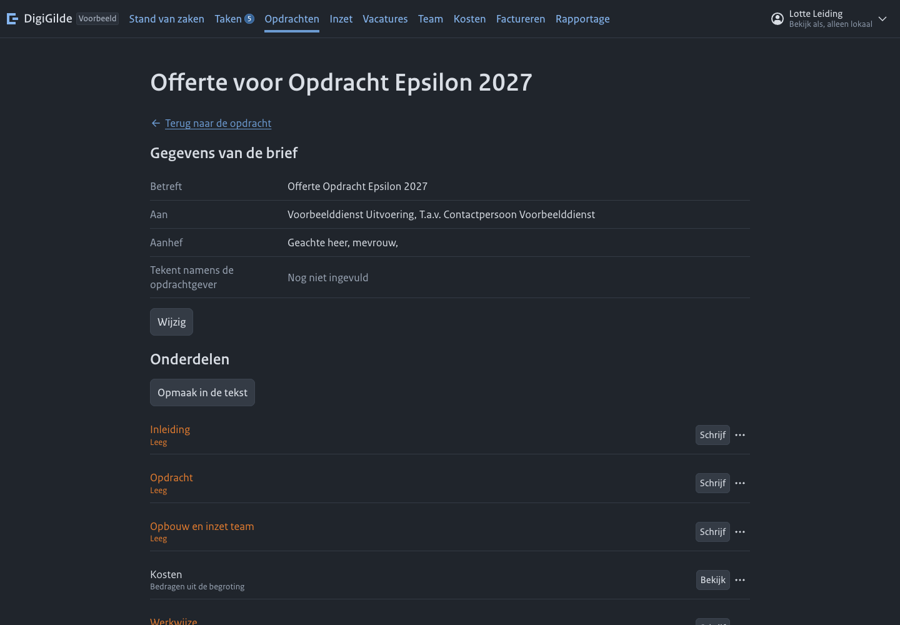
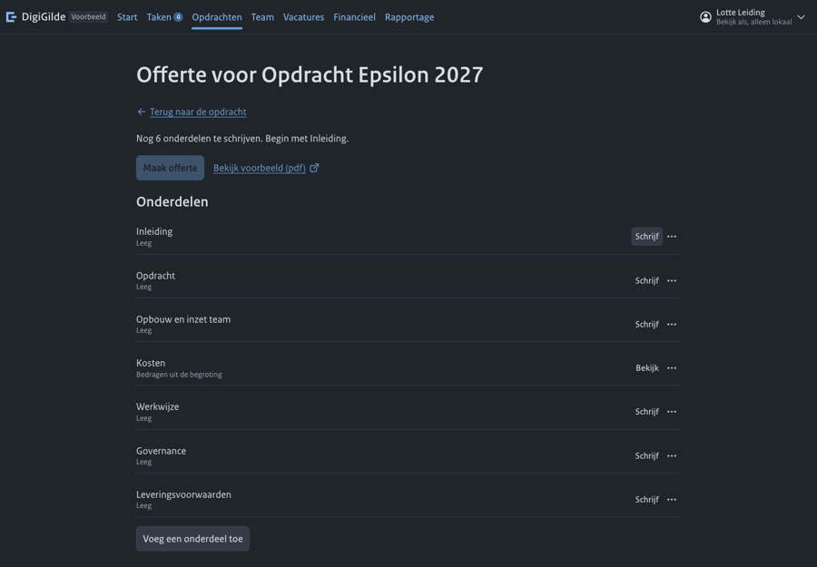
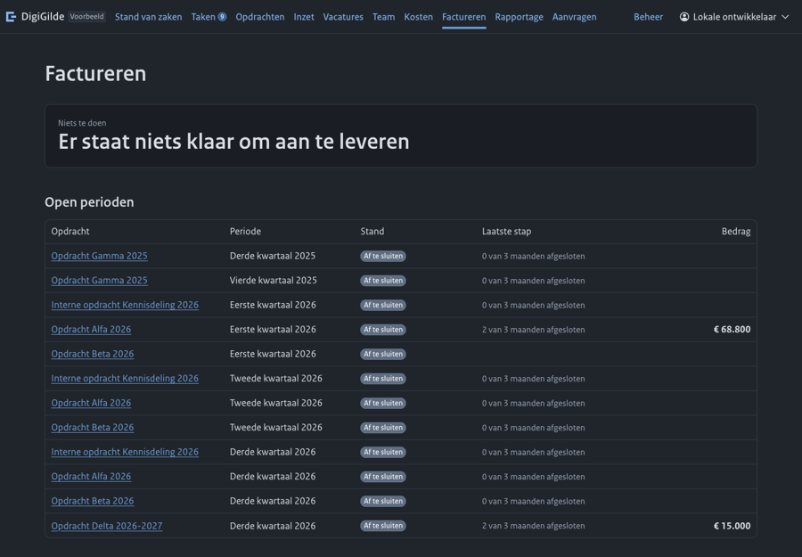
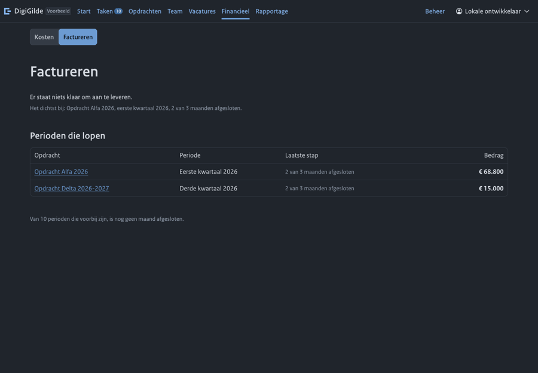
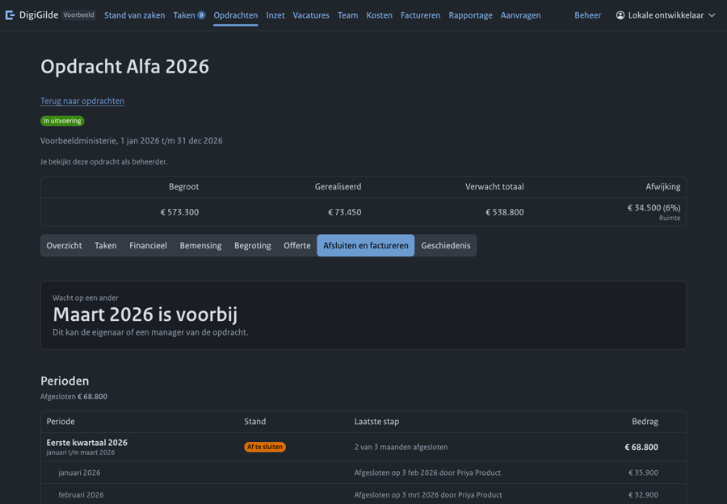
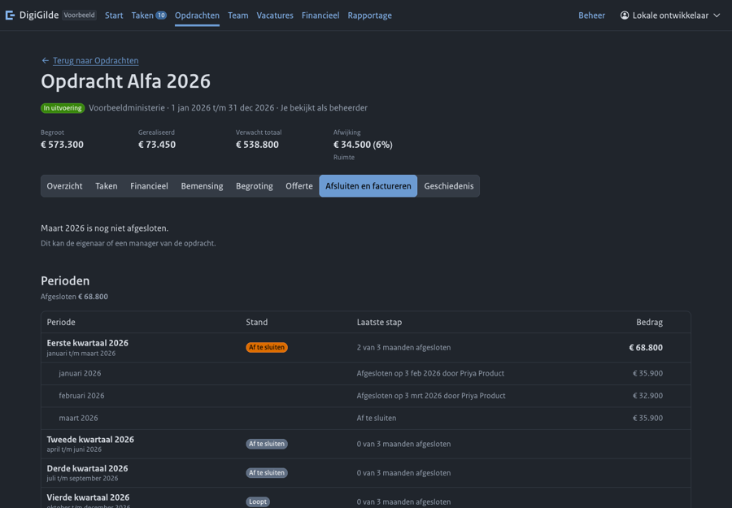
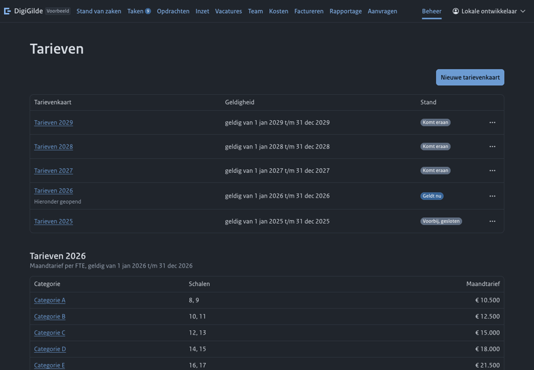
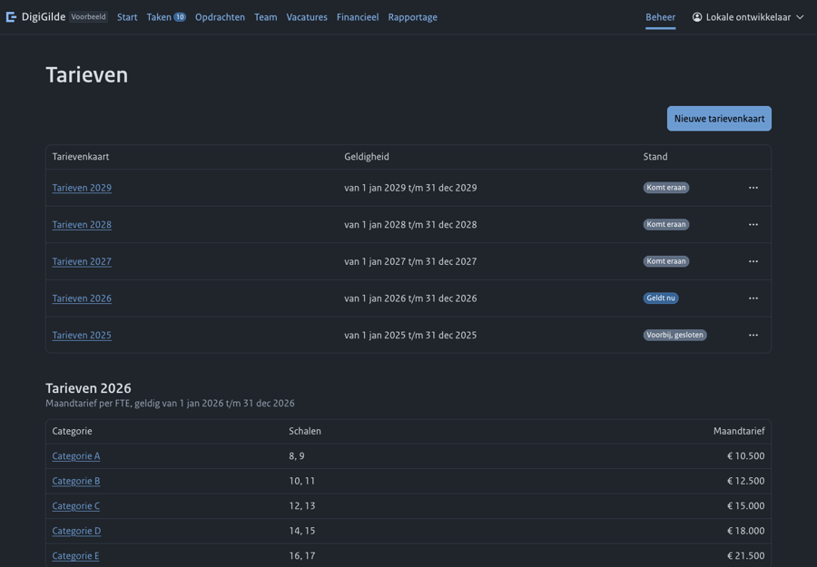

# Visuele hiërarchie: offerte, tekenen, opdrachtgever, factureren, kosten en tarieven

Dit is het verslag van één van de vier rondes over alle schermen. De toets per scherm: wat komt de lezer doen of leren, en landt het oog daar als eerste? Elk scherm is bekeken op een echte schermafbeelding, breed (1440) en smal (390), en daarna verkleind en wazig gemaakt om te zien waar het oog landt.

De afbeeldingen komen uit een kopie van de voorbeeldgegevens. Alle namen en adressen erin zijn verzonnen.

## Wat is bekeken

| Scherm | Als wie | Standen |
|---|---|---|
| Offertekaart op de tab Offerte | eigenaar, beheerder, lezer | gemaakt, aangeboden met tekenlink, tekenlink en document, getekend met bewijs, getekend zonder bewijs |
| Offerte schrijven | eigenaar | leeg, een onderdeel open |
| Wacht op mijn goedkeuring | beheerder | leeg |
| Beheer, offertes | beheerder | |
| Offertes om te tekenen, en een offerte tekenen | uitgenodigde ondertekenaar | open, getekend met ontvangstbewijs, donker en licht |
| Controleer een bewijs | ondertekenaar | leeg |
| Aanvragen, en offerte aanvragen | aanvrager, tekenbevoegde | leeg |
| Factureren | beheerder, eigenaar | niets klaar, een periode klaar zonder factuuradres |
| Factuurverzoek | eigenaar | aangeleverd |
| Afsluiten en factureren | eigenaar, beheerder | maand af te sluiten, periode klaar, periode aangeleverd |
| Kosten, en een kostenpost | beheerder, lezer | |
| Tarieven | beheerder | |
| Factuurverzoek en offertebrief als pdf | | |

Samen 22 schermen en standen, de meeste breed en smal.

## Wat is veranderd

| Scherm | Het oog landde op | Wat is veranderd | Het oog landt nu op |
|---|---|---|---|
| Offerte schrijven | 1 de gegevens van de brief, 2 zeven oranje namen, 3 zeven gelijke knoppen; de hoofdknop stond onder de vouw | De stand en de hoofdknop staan bovenaan, met in een zin waar je begint. De onderdelen volgen; alleen het eerstvolgende onderdeel heeft een knop die opvalt. Oranje is weg: de stand staat gedempt onder de naam. De gegevens van de brief staan onderaan. De uitleg over opmaak staat bij het veld waar je schrijft | 1 de titel, 2 de zin met "Maak offerte", 3 "Schrijf" bij het eerste lege onderdeel |
| Factureren, niets klaar | 1 een groot vlak "Er staat niets klaar", 2 twaalf keer hetzelfde label, 3 twee bedragen | Zonder iets te doen is er geen vlak maar een zin, met welke periode het dichtst bij is. De tabel toont alleen perioden waar iemand aan begonnen is; de rest is een regel. Een label staat er alleen als het iets onderscheidt | 1 de titel, 2 de zin, 3 de twee rijen met hun bedrag |
| Factureren, periode klaar zonder factuuradres | De zin zei dat er niets klaar stond terwijl een rij "Klaar om aan te leveren" toonde | De zin zegt dat de periode is afgesloten en dat het factuuradres ontbreekt | 1 de zin, 2 de rij met het label |
| Afsluiten en factureren, lezer die niets mag | 1 een groot vlak "Wacht op een ander: maart 2026 is voorbij" | Geen vlak en geen oproep: een zin met wat openstaat en wie het kan | 1 de rij van de periode die openstaat, 2 de zin |
| Offertekaart, na een besluit | De lijst van aanbiedingen bleef staan onder "Getekend" | Na het besluit staat alleen het besluit, met het bewijs | 1 het bedrag, 2 de stappenbalk, 3 de zin over het besluit |
| Offertekaart, aangeboden | Een losse knop met drie puntjes op een eigen regel onderaan | Het menu staat naast de ene knop als die er is, en anders bij de rustige links bovenaan | 1 het bedrag, 2 de stappenbalk, 3 de tekenlink |
| Ontvangstbewijs | "Bekijk pdf" stond er twee keer | Een keer | 1 de bevestiging, 2 "Download bewijs" |
| Offertes om te tekenen | Een kolom "Actie" met een link per rij | De naam van de offerte is de weg erin | 1 de titel, 2 de offerte die op akkoord wacht |
| Wacht op mijn goedkeuring | Een kolom "Actie"; het bedrag stond in het midden | De naam is de weg erin; het bedrag staat rechts als laatste kolom | |
| Regels van een offerte, smal | De tabel viel buiten het scherm | Op een smal scherm staan naam en bedrag naast elkaar, met de rest als een gedempte regel onder de naam | |
| Tarieven | Rijen van ongelijke hoogte door "Hieronder geopend"; "geldig van" op elke rij onder de kop "Geldigheid" | Elke rij is een regel; de cel geeft alleen de periode. Smal: de tabellen passen | 1 "Nieuwe tarievenkaart", 2 het label "Geldt nu" |
| Aanvragen, offerte aanvragen | Een alinea uitleg boven elke lijst en boven het formulier | De alinea's zijn weg. "De functie aanvrager" is "het recht aanvrager" | 1 de titel, 2 de keuze van de lijst, 3 "Offerte aanvragen" |

## De offertekaart, per stand

| Stand | De ene volgende stap |
|---|---|
| Gemaakt | "Bied aan" |
| Gemaakt, interne goedkeuring nodig | "Vraag goedkeuring" (niet bekeken, zie onder) |
| Aangeboden met een tekenlink | Geen knop: wachten op de opdrachtgever. De tekenlink staat klaar om te kopiëren |
| Aangeboden als document | "Leg getekende pdf vast" |
| Tekenlink en document samen | Geen knop; vastleggen staat in het menu |
| Getekend of afgewezen | Geen; het besluit en het bewijs |
| Begroting gewijzigd sinds de offerte | "Maak nieuwe offerte" (niet bekeken) |

## Voor en na

| Voor | Na |
|---|---|
|  |  |
|  |  |
|  |  |
|  |  |

Zonder voorganger in beeld: [de offertekaart, aangeboden](c/offertekaart-aangeboden.png), [de offertekaart, getekend](c/offertekaart-getekend.png), [het ontvangstbewijs in licht](c/ontvangstbewijs.png), [tekenen op een smal scherm](c/tekenen-smal.png), [een periode die klaar is](c/afsluiten-klaar.png).

## De pdf's

- **Factuurverzoek.** Het percentage staat er goed ("100%", "60%"); de eerdere fout "2E+2%" is weg. De kop "Contact bij de opdrachtgever" stond tegen de regel erboven; dat is hersteld in het sjabloon. Een kwartaal met drie rollen loopt net over op een tweede pagina, met daar één regel en het totaal.
- **Offertebrief.** De opbouw is rustig: briefhoofd, betreft, aanhef, genummerde onderdelen, de kostentabel. Een leeg onderdeel staat in het voorbeeld als kop zonder tekst; dat klopt voor een concept.

## Bewust gelaten

- Op de tekenpagina staat "Wijs af" naast "Geef akkoord": het zijn de twee antwoorden op dezelfde vraag.
- De grijze labels "Af te sluiten" bij perioden die nog niet aan de beurt zijn, op de tab van een opdracht.
- De drie balken en cijfers van een kostenpost; die zijn vandaag ontworpen en lezen goed, ook smal.
- "Je functie" op het formulier voor een akkoord is de functie van de ondertekenaar, niet een recht in grip.

## Niet bekeken

- Een ontvangen offerte en een opdracht aan de kant van de opdrachtgever: daar zijn twee gekoppelde instanties voor nodig.
- De goedkeurpagina met een offerte, en de offertekaart met interne goedkeuring.
- Een afgewezen en een vervangen offerte op het scherm.
- "Controleer een bewijs" met een bestand.
- De mailstanden van een tekenlink (wordt gemaild, gemaild, niet afgeleverd).
- Het factuurverzoek na de herstelling van de kop: een levering wordt één keer opgemaakt.
- Lichte modus buiten de tekenpagina, het ontvangstbewijs en de offertekaart.
