# Visuele hiërarchie, deel D: beheer, rapportage, inloggen

De ronde over alle schermen is in vier delen gedaan. Dit deel gaat over de
statuspagina's, de beheerpagina's, rapportage, geschiedenis en activiteit,
meldingen, beveiliging en de afzender van offertes.

Per scherm is een schermafbeelding gemaakt op 1440 en 390 breed, in het donker,
en daarna wazig bekeken: waar landt het oog als eerste, tweede en derde? Landt
het niet op wat de lezer hier komt doen of weten, dan is het scherm aangepast en
opnieuw bekeken. Inloggen, de statuspagina's en Beheer zijn ook in het licht
bekeken.

## De toets

1. Wat komt deze lezer hier doen of weten? Dat staat vooraan, als de ene
   hoofdknop of als de ene zin.
2. Hooguit drie niveaus: het nu, de lijst, detail op verzoek.
3. Eén kader, één linkerrand, tussenruimte uit de schaal.
4. Niets dat de interface uitlegt, niets dubbel, niets dat er niet is.
5. Wie alleen mag lezen ziet geen acties en één rustige regel.
6. Op 390 breed valt niets weg en schuift niets opzij.

## Per scherm

| Scherm | Lezer | Oog vóór (1, 2, 3) | Wat is veranderd | Oog na (1, 2, 3) |
|---|---|---|---|---|
| Beheer | beheerder | Tien gelijke regels; geen eerste | Vijf groepen naar wat een beheerder doet, elke regel in een paar woorden | Titel, groepskoppen, regels |
| Beheer | ieder ander | Melding | Ongewijzigd | Melding |
| Activiteit | beheerder | Muren van "Gegevens van … ingezien" | Standaard alleen wijzigingen; inzage is een keuze; een reeks inzages is één regel met een aantal; filters zeggen wat ze zijn | Filters, eerste wijziging, wie |
| Geschiedenis (tab) | iedere lezer | Eén alinea van veertig wijzigingen aan elkaar | Kop, drie regels, de rest op verzoek; elke wijziging op een eigen regel; inzage staat er niet | Wat er gebeurde, drie regels, "Toon alle" |
| Afzender, leeg | beheerder | Twaalf keer "Nog niet ingevuld", drie gelijke knoppen | Eén zin en één hoofdknop; lege regels zijn weg | Titel, hoofdknop, onderdelen |
| Afzender, gevuld | beheerder | Lijsten met lege regels | Alleen wat is ingevuld | Titel, organisatie, onderdelen |
| Beveiliging, leeg | iedereen | Knop rechts, melding in het midden van een leeg vlak | Zin en knop staan bij elkaar, links onder de titel | Titel, zin, knop |
| Meldingen, niet ingesteld | iedereen | Melding, daarna vinkjes en stille uren die niets doen | Alleen de melding | Melding |
| Meldingen, uit | iedereen | Uitleg, knop, vinkjes | Wat je krijgt staat onder de titel; de knop is het enige; voorkeuren pas als het aanstaat | Titel, knop |
| Koppelingen | beheerder | Waarschuwing, grijze knop, vijf kolommen met "Bekijk" per rij | Eén hoofdknop; de rij opent; status alleen als een koppeling uitstaat | Knop, namen |
| Koppelingen | ieder ander | Knop "toevoegen" en een laadteken dat blijft | Eén regel: voor beheerders | Regel |
| Voorstellen uit Wies | beheerder | Uitleg, lijst waarin naam en adres in elkaar lopen, knop onderaan | Knop bovenaan; naam in een eigen kolom; "Toevoegen:" en de vaste reden per rij zijn weg | Knop, groepskop, namen |
| Organisaties | beheerder | Knoppen, drie secties | Teruglink; "Staat op zichzelf" per rij weg; kortere hulptekst | Hoofdknop, stand, tabel |
| Rapportage | beheerder | Vier rode kaders van zeven | Alleen de linkerrand van een tegel die aandacht vraagt is gekleurd | Grootste bedragen, rode regels |
| Rapport van een opdracht | eigenaar, beheerder | Twee teruglinks onder de titel, een kader met adressen voor systemen | Eén teruglink boven de titel; wie, wanneer en soort als één regel; adressen staan alleen in de afdrukbare versie | Titel, vier cijfers, wat is afgesproken |
| Onderwerp van rapportage | iedereen | Teruglink onder de titel | Teruglink boven de titel | Titel, cijfers |
| Bezetting | planner, beheerder | "!" als teken in een cel | Het vaste aandachtsteken | Ongewijzigd |
| Niet gevonden, geen toegang, niet bereikbaar | iedereen | Titel bovenaan, waarschuwingsteken en knop ver daaronder | Eén blok in het midden: merk, titel, zin, knop | Titel, zin, knop |
| Inloggen | iedereen | Merk, titel, knop | Ongewijzigd; licht en donker bekeken | Titel, knop |

## Beelden

Voor en na staan in `docs/hierarchie/d/`, per scherm als `<scherm>-voor.png` en
`<scherm>-na.png`.

| Voor | Na |
|---|---|
| 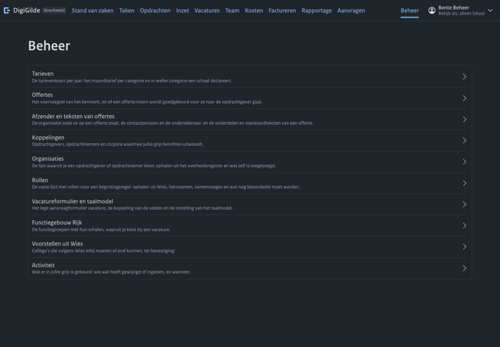 | 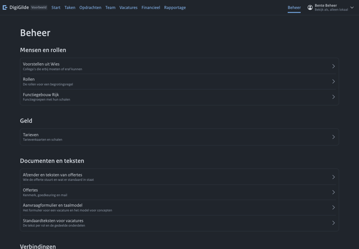 |
| 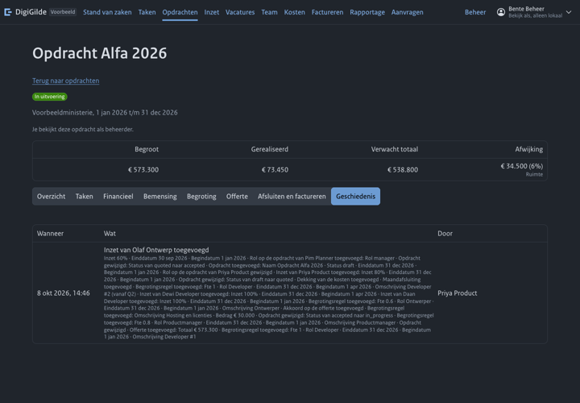 | 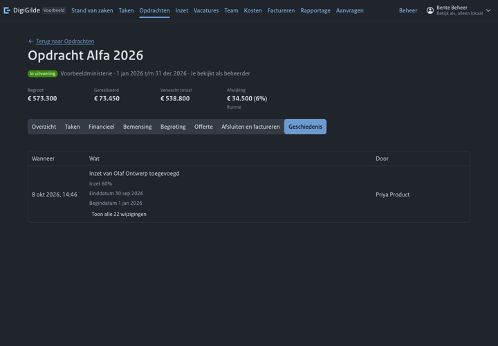 |
| 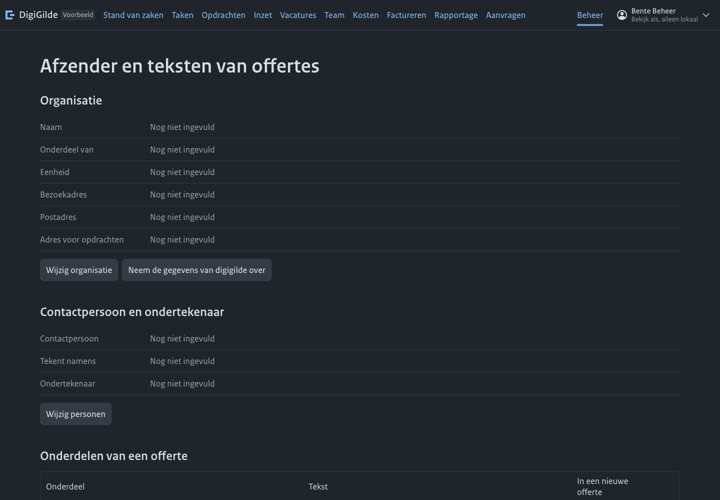 | 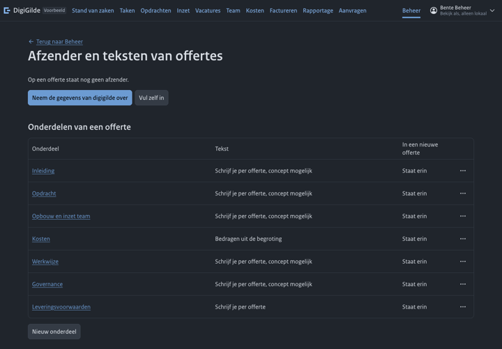 |
| 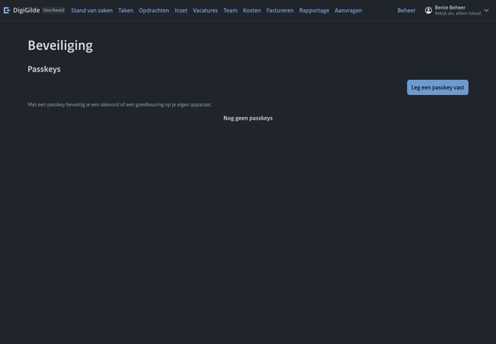 | 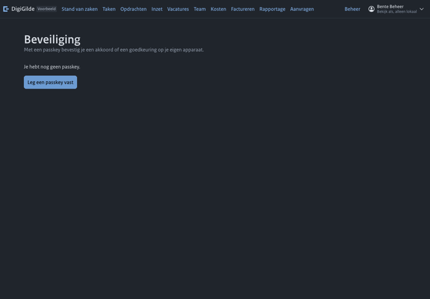 |
| 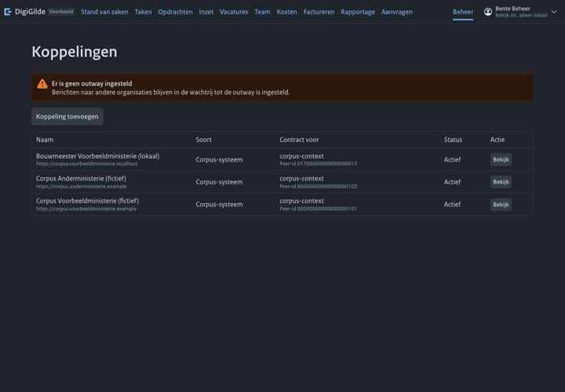 | 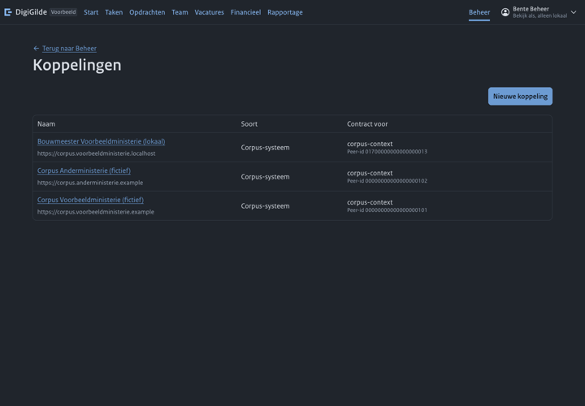 |
| 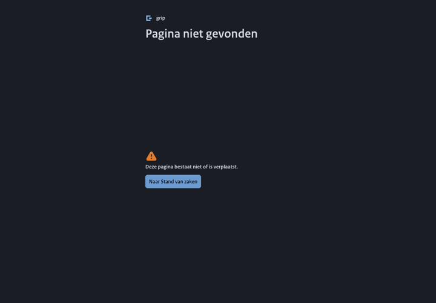 | 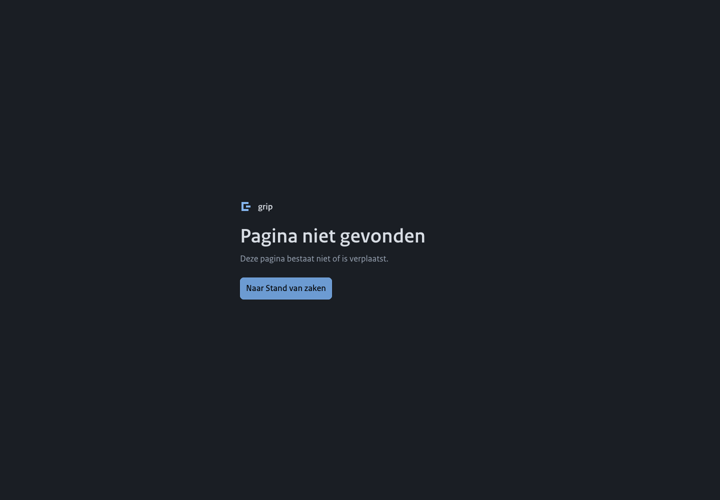 |

## Wat open blijft

- **Activiteit en inzage.** Elke keer dat iemand een lijst met mensen opent,
  wordt per persoon een inzage vastgelegd. Die regels zijn veel talrijker dan
  wijzigingen. Het scherm filtert ze nu zelf weg en leest daarvoor ver terug;
  na 1200 gebeurtenissen zonder wijziging zegt het dat en biedt het aan verder
  te zoeken. De server hoort wijzigingen zonder inzage te kunnen geven.
- **Waarden in de geschiedenis.** Sommige waarden staan er nog als code, zoals
  de reden van een rol.
- **Tegels met nul.** Een eigenaar zonder offertes ziet een tegel "€ 0".
- **Jaarverantwoording.** De tabel is breder dan de pagina op 1440.
- **Toezicht op 390.** De tabel van Activiteit heeft op smal één kolom; de
  filters zitten dan achter één knop.
