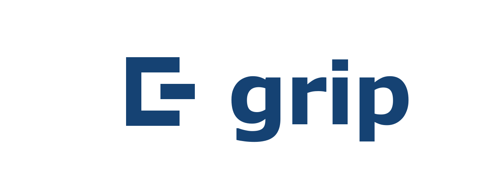
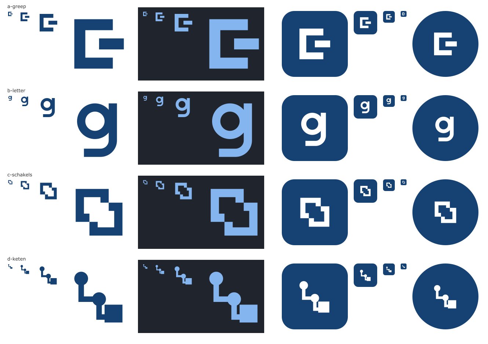

# Het merk van grip

Dit document zegt hoe grip zich laat zien: het beeldmerk, de naam, de zin, en waar het product staat ten opzichte van de organisatie die het gebruikt. De regels voor schermen staan in [ontwerp.md](ontwerp.md). Het besluit staat in [ADR 0036](adr/0036-een-productmerk-naast-de-organisatie.md).

## Twee lagen

Er staan altijd twee afzenders in beeld, en ze zijn niet hetzelfde.

| Laag | Wat het is | Waar het vandaan komt |
|---|---|---|
| Het product | grip. Overal gelijk: hetzelfde beeldmerk, dezelfde naam, dezelfde zin | Deze repo |
| De organisatie | Wie deze instantie draait, met een eigen naam en een eigen huisstijl | Instellingen van de instantie |

De organisatie is de afzender van alles wat de deur uit gaat. Het product is het gereedschap waarmee dat gebeurt.

| Plek | De organisatie | Het product |
|---|---|---|
| Balk bovenaan | De naam, als link naar de start | Het beeldmerk voor de naam |
| Balk op een telefoon | Alleen in de naam voor een schermlezer | Het beeldmerk, als link naar de start |
| Inlogpagina | In de kop: "Inloggen bij <organisatie>" | Beeldmerk, naam en de zin, erboven |
| Tekenpagina voor een gast | Eerst, vet: wiens pagina dit is | Eronder, klein: "met grip" |
| Tabblad van de browser | In het midden | Achteraan |
| Statuspagina's (laden, niet gevonden, geen toegang) | Niet: de organisatie is dan nog niet altijd bekend | Beeldmerk en naam boven de kop |
| Mail met een tekenlink | Afzender, aanhef en ondertekening | Een keer, in de uitleg hoe je de mail controleert |
| Offerte als pdf | Het hele document | Niet |
| Bewijs van een akkoord | Wie besloot en namens wie | Een regel onderaan: waarmee het is vastgelegd |
| Geinstalleerde app | In de naam van de app | Het pictogram |

Een aantekening over de omgeving, zoals "voorbeeld" bij de voorbeeldgegevens, hoort bij geen van beide. Zij staat als label naast de naam.

## Het beeldmerk

Een haak die een balk vasthoudt. De haak is de greep; de balk is wat je vasthoudt: een opdracht. Samen lezen ze ook als de letter g.

- Getekend op een raster van 48 bij 48.
- Een dikte: 8. De haak is 28 breed en 36 hoog, de balk 18 bij 8.
- Rechte hoeken, geen afrondingen, geen verloop, geen schaduw.
- Een kleur.
- Vrije ruimte rondom: 6, driekwart van de dikte. Daarbinnen staat niets.
- Kleinste maat: 16 pixels. De dikte is dan ruim 2,5 pixel.

De bron is `frontend/brand/mark.svg`. Alle afgeleide bestanden maakt `just brand`; pas ze niet met de hand aan.

| Bestand | Maat | Waarvoor |
|---|---|---|
| `frontend/public/favicon.svg` | vector | Tabblad; volgt licht en donker |
| `frontend/public/favicon.ico` | 16, 32, 48 | Browsers zonder svg-pictogram |
| `frontend/public/apple-touch-icon.png` | 180 | Beginscherm op iOS |
| `ontwikkelportaal/public/` `favicon.svg`, `favicon.ico` en `apple-touch-icon.png` | als hierboven | Dezelfde drie voor het ontwikkelportaal, waarvan het image zonder `frontend/` wordt gebouwd |
| `frontend/public/icons/icon-192.png` | 192 | App-pictogram |
| `frontend/public/icons/icon-512.png` | 512 | App-pictogram |
| `frontend/public/icons/icon-maskable-192.png` | 192 | App-pictogram dat het systeem bijsnijdt |
| `frontend/public/icons/icon-maskable-512.png` | 512 | App-pictogram dat het systeem bijsnijdt |
| `frontend/public/icons/icon-mono.svg` en `icon-mono-512.png` | vector, 512 | Plekken die zelf een kleur geven |
| `docs/merk/grip.png` | 1280 breed | README en voorvertoning van een link |
| `docs/merk/richtingen.png` | | Alle getekende richtingen naast elkaar |

In de schermen is het beeldmerk het onderdeel `BrandMark` uit `frontend/src/brand`. Naam en beeldmerk samen buiten de balk is `Brand`, in drie vormen: `login`, `signing` en `compact`.

### De richtingen die zijn getekend

| Richting | Idee | Oordeel |
|---|---|---|
| a. Greep | Een haak die een balk vasthoudt | Gekozen. Zegt wat de naam zegt, is hoekig zoals de huisstijl, blijft op 16 pixels een vorm |
| b. Letter | De kleine letter g uit een cirkel en een haal | Vriendelijk en leesbaar, maar een letter in een rondje hebben veel producten al |
| c. Schakels | Twee kaders die in elkaar grijpen: instanties die elkaar vasthouden | Het beste beeld voor de federatie, maar op 16 pixels een vlek |
| d. Keten | Van wens via doel naar opdracht | Legt uit in plaats van te merken; te fijn voor een pictogram |

De bronnen staan in `frontend/brand/richtingen/`. Een andere kiezen is: het bestand naar `mark.svg` kopieren, de twee paden in `BrandMark.tsx` vervangen en `just brand` draaien.

## Kleur

Uit de tokens van het designsysteem, nooit een eigen blauw.

| Waar | Token | Contrast |
|---|---|---|
| Beeldmerk op een licht vlak | `--primitives-color-reference-lintblauw` | 10,2 op wit |
| Beeldmerk op een donker vlak | `--primitives-color-lintblauw-750` | 7,3 |
| Pictogram: wit beeldmerk op lintblauw | dezelfde twee | 10,2 |

De losse bestanden kunnen geen tokens lezen. De twee waarden staan daarom een keer in `frontend/scripts/build-brand.mjs` en nergens anders.

## Naam en zin

- De naam is **grip**, met een kleine letter, ook in de titel van een tabblad. Aan het begin van een zin krijgt het een hoofdletter, zoals elk woord.
- De zin: **Grip op opdrachten, van offerte tot verantwoording.**

Overwogen en niet gekozen:

- "Zie wat een opdracht kost, wie eraan werkt en wat er nog moet gebeuren." Waar, maar het is een opsomming.
- "Voor wie opdrachten uitvoert voor de overheid." Zegt voor wie, niet wat.

De zin staat op de inlogpagina en hoort in de README en in de omschrijving van de app. Hij staat in `frontend/src/brand/names.ts`.

## Titel van een tabblad

`<pagina> · <organisatie> · grip`

De pagina staat voorop, want dat is wat tussen tabbladen verschilt en wat overblijft als de titel wordt afgekapt. Daarna wiens grip het is, daarna het product. Is de organisatie nog niet bekend, dan valt dat deel weg. De functie is `documentTitle` in `frontend/src/brand/names.ts`; schrijf een titel nergens met de hand.

## Hoe grip praat

Dit vult de vaste woorden in [ontwerp.md](ontwerp.md) aan.

- Gewoon Nederlands, met je.
- Zegt wat waar is, ook als dat niet mooi is: "Er is niets vastgelegd."
- Zegt wat je kunt doen, niet hoe het systeem werkt.
- Noemt dingen zoals de lezer ze noemt: opdracht, offerte, begroting.

Grip doet nooit dit:

- juichen, bedanken of uitroeptekens gebruiken;
- een oordeel geven over iets waar de lezer niets aan kan doen;
- zichzelf noemen waar de organisatie de afzender is.

## Wat mag van de Rijkshuisstijl

Wat hier regel is en wat oordeel, staat erbij.

**Regel, met bron:**

- Het rijkslogo en de huisstijl zijn alleen bestemd voor de Rijksoverheid en voor wie in haar opdracht werkt. Bron: de [Regeling voorbehouden auteursrecht beeldmerk en huisstijl herkenbare Rijksoverheid](https://wetten.overheid.nl/BWBR0024004/2008-08-07) en `NOTICES.md` in het pakket van het designsysteem.
- Het rijkswapen mag alleen samen met het lint worden gebruikt. Bron: dezelfde `NOTICES.md`.
- Het lettertype Rijksoverheid Sans is alleen bestemd voor publicaties van de Rijksoverheid en voor wie in haar opdracht werkt. Bron: dezelfde `NOTICES.md`, met verwijzing naar de gebruiksvoorwaarden op rijkshuisstijl.nl.
- Organisaties die direct onder een minister vallen voeren het rijkslogo; het logo bestaat uit het lint met het wapen en de naam van de organisatie ernaast. Bron: [Rijkshuisstijl en rijkswebsites](https://www.rijksoverheid.nl/onderwerpen/overheidscommunicatie/rijkshuisstijl-en-rijkswebsites) op rijksoverheid.nl.

**Niet kunnen nalezen:** de richtlijnen op rijkshuisstijl.nl zelf staan achter een inlog. Of zij iets zeggen over een eigen beeldmerk voor een product of applicatie, en over een pictogram voor een app, is dus niet vastgesteld. Vraag het na bij de huisstijlcoordinator van het departement voordat grip breed wordt uitgerold.

**Oordeel, van deze repo:**

- Grip krijgt een ingetogen productmerk en geen logo dat met het rijkslogo wedijvert. Het staat nooit op de plek van het rijkslogo en nooit op een document van de organisatie.
- Het rijkslogo wordt niet aangepast, niet nagetekend en niet als pictogram van de app gebruikt. Het eerdere pictogram van het tabblad was het rijkslogo uit het designsysteem; dat is vervangen, omdat een tabblad het product moet aanwijzen en niet de overheid als geheel.
- Het beeldmerk gebruikt het blauw van het lint en is hoekig, zodat het bij de huisstijl past zonder er een onderdeel van te lijken.

## Een organisatie buiten de Rijksoverheid

Een instantie van een organisatie die de huisstijl niet mag voeren, zet het lint en het lettertype niet aan (zie [De offerte als document](offerte-document.md)). Het productmerk blijft hetzelfde: het is een eigen tekening en geen onderdeel van de huisstijl. De afbeelding boven aan dit document is zo gemaakt: het beeldmerk met de naam in Verdana, het lettertype dat de huisstijl zelf als vervanger noemt.

Open punt: de schermen laden het lettertype en de kleuren van het designsysteem voor elke instantie. Een instantie buiten de Rijksoverheid heeft daarvoor een eigen thema nodig. Dat bestaat nog niet.
