# Evaluatie van het hoofdmenu

Stand: 8 oktober 2026. Dit is de evaluatie met het advies. De gebruiker heeft variant E gekozen; die is gebouwd en vastgelegd in ADR 0042. Eén verschil met het advies: Team opent voor een planner op Inzet.

De vraag was: wat hoort er wel en niet in het menu? Aanleiding: met Factureren telt de balk elf onderdelen.

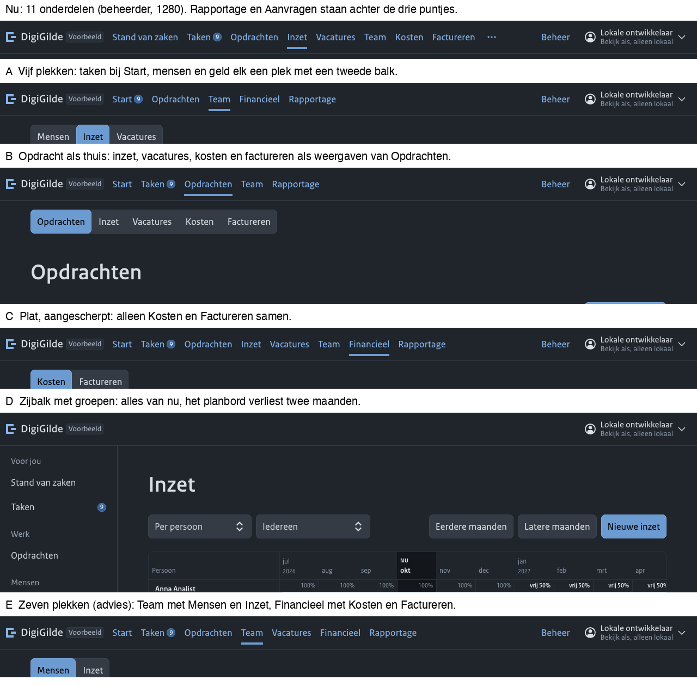

## Kort

- **Advies: variant E, zeven plekken.** Start, Taken, Opdrachten, Team, Vacatures, Financieel, Rapportage. Aanvragen alleen voor wie die rol heeft. Beheer rechts, apart.
- Inzet wordt een weergave onder Team. Kosten en Factureren worden twee weergaven onder Financieel.
- Geen adres verandert. De bouw is ongeveer een halve dag.
- De frequenties in dit stuk zijn afgeleid uit het domein en de taken, niet gemeten bij gebruikers. Wat je hun moet vragen staat onderaan.

## Het menu nu

Werk: Stand van zaken, Taken, Opdrachten, Inzet, Vacatures, Team, Kosten, Factureren, Rapportage, Aanvragen. Rechts: Beheer en het accountmenu.

Gemeten in een browser, met de woorden van nu:

| Lezer | Onderdelen | Past op 1280 | Past op 1024 |
|---|---|---|---|
| Beheerder | 11 | 9, de rest achter de drie puntjes | 6 |
| Eigenaar of manager | 9 | 9 | 6 |
| Planner (ook manager in de voorbeeldgegevens) | 9 | 9 | 6 |
| Lezer | 7 | 7 | niet gemeten |
| Teamlid | 4 | 4 | 4 |
| Aanvrager | 4 | 4 | 4 |

De balk heeft dus ruimte voor ongeveer negen korte woorden op 1280 en zes op 1024. Bij de beheerder is het minder, omdat Beheer en de naam rechts ruimte nemen.

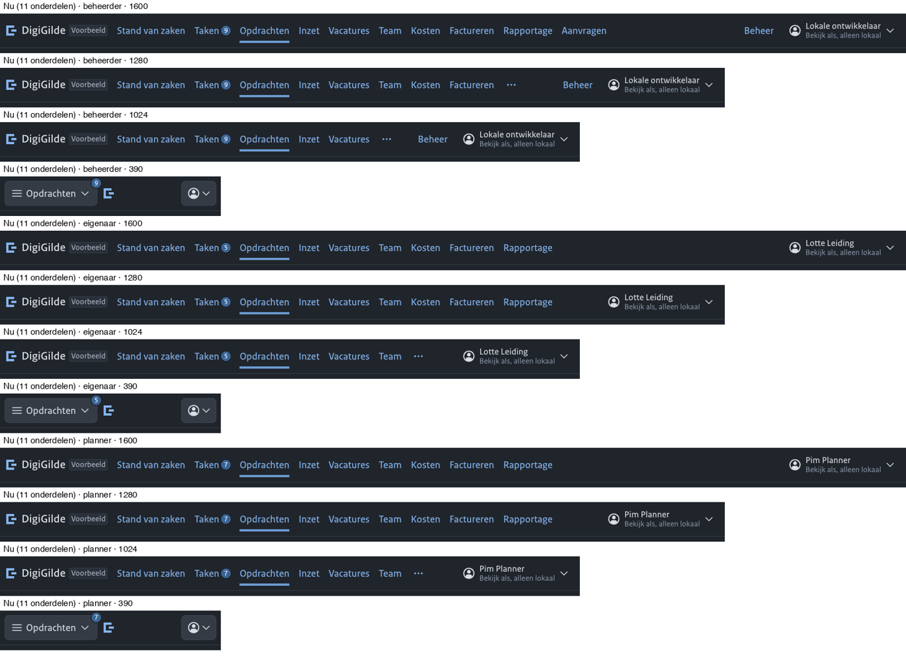

## Bewijs

### Waar het werk is: waar taken mensen heen sturen

De taaksjablonen zeggen per taak waar je het werk doet (`backend/grip/data/tasks/guidance.json`). Van de 29 sjablonen:

| Bestemming | Aantal sjablonen |
|---|---|
| Een tab van een opdracht (begroting, offerte, bemensing, maandafsluiting, overzicht) | 12 |
| Een tab van een vacature (aanvraag, advies, tekst, procedure, vervulling) | 14 |
| Goedkeuren van een offerte | 1 |
| Een ontvangen offerte | 1 |
| Het rapport van een opdracht | 1 |
| Inzet, Team, Kosten, Factureren, Rapportage, Beheer | 0 |

Het dagelijkse werk bereikt iemand via een taak en speelt zich af binnen een opdracht of een vacature. Het menu is er dus voor oriëntatie: de lijsten van die twee dingen, en de blik over opdrachten heen.

### Wie heeft wat hoe vaak nodig

Afgeleid uit `docs/domein.md`, `docs/toegang.md`, de taken en wat een pagina iemand laat doen.

| Lezer | Dagelijks | Wekelijks | Maandelijks of per kwartaal | Zelden |
|---|---|---|---|---|
| Eigenaar of manager | Taken, eigen opdrachten | Inzet, Vacatures tijdens werving | Factureren, Kosten, Rapportage | Team |
| Planner | Inzet | Vacatures, Team, Opdrachten | | |
| Leidinggevende | | Team, Inzet | | Vacatures |
| Beheerder | | Team, Beheer | Tarieven en andere instellingen | de rest, om mee te kijken |
| Lezer | | Opdrachten, Rapportage | Kosten, Factureren | |
| Teamlid | Taken, de eigen opdracht | | | Vacatures |
| Aanvrager of tekenbevoegde | | Aanvragen, Taken | | |

### Overlap

- **Stand van zaken en Taken.** De startpagina toont "Mijn taken" al, naast wat aandacht vraagt en de cijfers. Taken heeft daarnaast "Wacht op anderen" en het bord. Het zijn twee blikken op hetzelfde, maar Taken is voor iedereen dagelijks en draagt het getal.
- **Team en Inzet.** Allebei de mensen. Team is de lijst, met per persoon de inzet nu en vooruit. Inzet is hetzelfde over de tijd. Dit is één ding met twee weergaven.
- **Kosten en Factureren.** Geld eruit en geld erin, over opdrachten heen. De pagina Kosten heet zelf al "Kosten en facturen". Voor de meeste lezers maandelijks of per kwartaal.
- **Opdrachten, Inzet en Vacatures.** Inzet en vacatures bestaan ook binnen een opdracht (tab Bemensing). De onderdelen in het menu zijn de blik over alle opdrachten.
- **Aanvragen.** Geen onderdeel van het werk van een opdrachtnemer, maar een andere rol van dezelfde applicatie. De beheerder ziet het nu altijd, ook in een instantie die nooit opdrachtgever is.

### Hoe je bij een pagina komt

| Pagina | Bereikbaar via |
|---|---|
| Factureren | alleen het menu en de link in een mail; geen link vanaf Kosten of de startpagina |
| De lijst Goedkeuren | nergens; alleen één offerte, via een taak |
| Bewijs controleren | alleen vanaf een ontvangstbewijs |
| Open rollen, Standaardteksten, Vacatureformulier en taalmodel | drie links in de actiebalk van Vacatures; de regel is hooguit één |
| Alle pagina's onder Beheer | de overzichtspagina Beheer |
| Beveiliging, Meldingen | het accountmenu |

Twee wezen dus: Factureren hangt aan het menu alleen, en de lijst Goedkeuren hangt nergens aan.

### Wat het designsysteem zegt

Uit de ontwerprichtlijnen van het designsysteem (`nldd-design`, hoofdstuk Navigatie en structuur):

> Content is leidend, UI is ondersteunend. [...] Verwerk UI en navigatie zoveel mogelijk in de content zelf en beperk zowel de hoeveelheid als de nadruk van UI daarbuiten. Dat geldt ook voor het menu: laat de homepage zelf het menu zijn, in plaats van de nadruk te leggen op een rijtje woorden in de header.

> Geen megamenu's.

> Geen vage container-begrippen. Vermijd "informatie", "documenten", "downloads", "service", "folders", "algemeen".

> Vermijd een sticky header. De inhoud is belangrijker dan de balk erboven.

Er staat geen maximum aantal onderdelen in. De menubalk van het designsysteem zet wat niet past achter een knop; dat is een vangnet, geen ontwerp.

### Vergelijkbare gereedschappen

Uit algemene kennis, niet nagezocht: gereedschap voor projectorganisaties groepeert meestal in projecten, mensen of capaciteit, financiën en rapporten. Dat past op grip. Grip wijkt af op twee punten, met reden: vacatures zijn een eigen ding met een eigen verloop, en de rol van opdrachtgever zit in dezelfde applicatie.

## Criteria

1. Een onderdeel verdient een plek als iemand het minstens wekelijks nodig heeft én het een plek is waar je heen gaat, niet iets dat je vanuit een opdracht of vacature bereikt.
2. Een zelfstandig naamwoord dat de lezer zelf gebruikt. Geen vaag verzamelwoord.
3. Niet twee onderdelen voor één ding.
4. Hooguit zeven voor één lezer. Dat past op 1280 zonder iets weg te stoppen, en op 1024 voor iedereen behalve de beheerder.
5. Hetzelfde onderdeel staat voor iedereen op dezelfde plek. Verbergen mag, verplaatsen niet.
6. Taken sturen mensen naar het werk. Het menu is voor oriëntatie.

## De varianten

Alle varianten zijn echt getekend in een kopie van de frontend, als de beheerder, een eigenaar en een planner, op 1600, 1280, 1024 en 390 pixels, donker.

### A. Vijf plekken

Start (met het getal, en Taken als tweede weergave), Opdrachten, Team (Mensen, Inzet, Vacatures), Financieel (Kosten, Factureren), Rapportage.

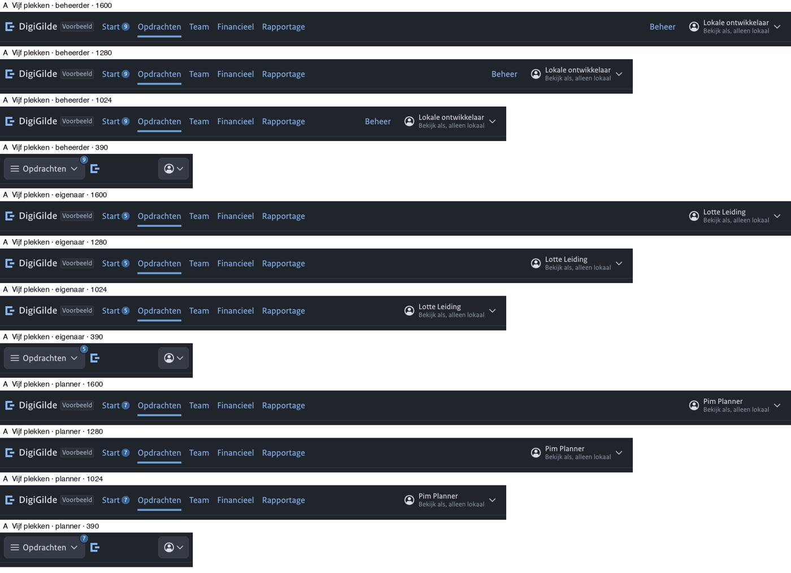
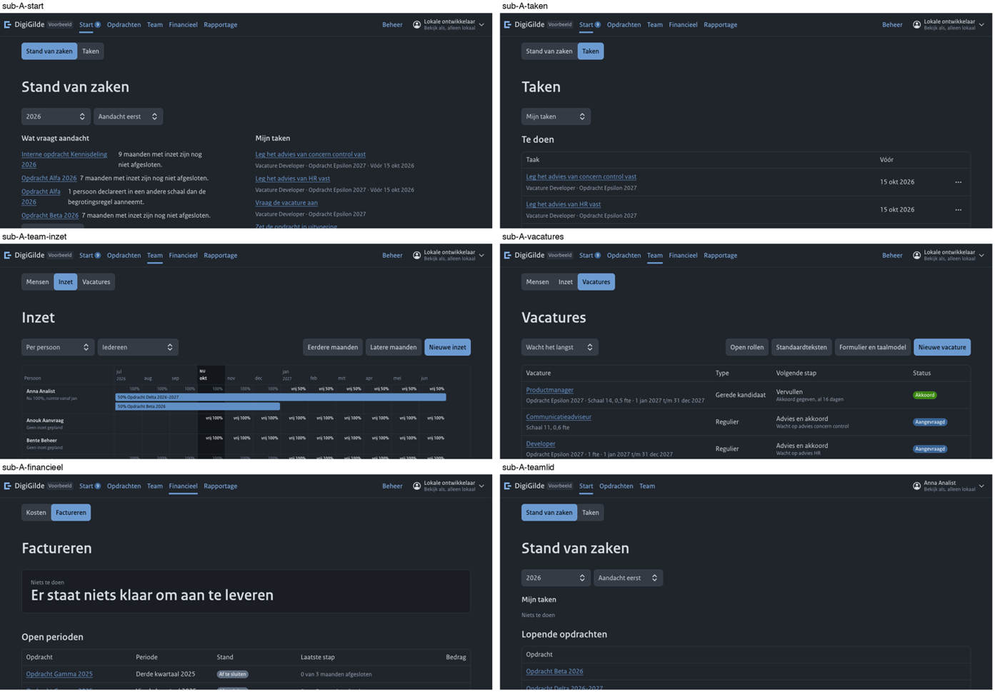

- Beter: past overal, ook op 1024. Vijf woorden.
- Slechter: drie onderdelen krijgen een tweede balk. Het getal staat op "Start", en Taken is een klik verder terwijl het voor iedereen dagelijks is. Een teamlid en een aanvrager zien "Team" en komen bij Vacatures uit. Op Vacatures staan dan de tweede balk en drie links in de actiebalk boven elkaar.
- Kosten: het grootst van de bovenbalk-varianten; de startpagina moet opnieuw worden ingedeeld.

### B. De opdracht als thuis

Start, Taken, Opdrachten (met Inzet, Vacatures, Kosten en Factureren als weergaven), Team, Rapportage.

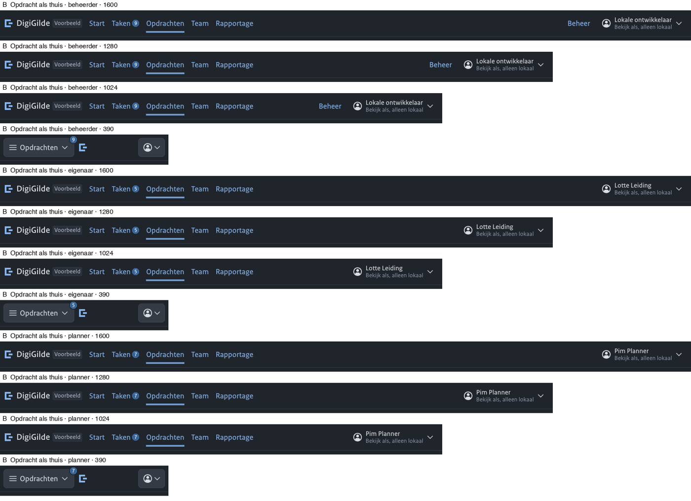
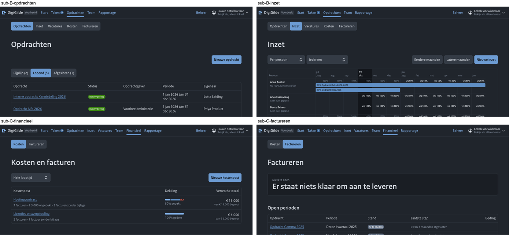

- Beter: vijf woorden, en het sluit aan bij waar het werk is.
- Slechter: de tweede balk heeft vijf weergaven en staat op Opdrachten direct boven de balk Pijplijn, Lopend, Afgesloten: twee gelijke balken boven elkaar. De planner vindt het dagelijkse planbord onder "Opdrachten". Kosten zijn kostenposten, geen opdrachten.

### C. Plat, aangescherpt

Start, Taken, Opdrachten, Inzet, Vacatures, Team, Financieel, Rapportage.

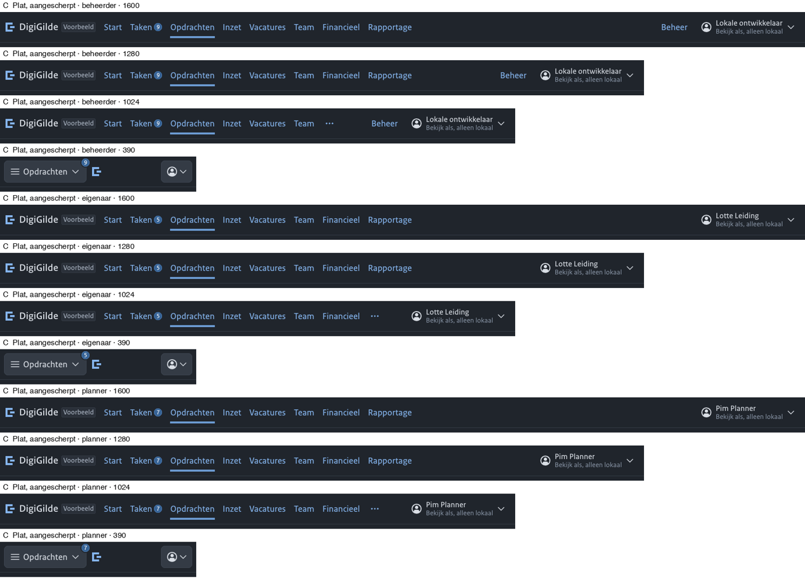

- Beter: de kleinste verandering. Alleen Financieel krijgt een tweede balk.
- Slechter: acht voor de eigenaar en de planner. Op 1024 valt Rapportage weg, en bij de beheerder ook Financieel. Team en Inzet blijven twee woorden voor één ding.

### D. Zijbalk met groepen

Alles van nu, in groepen langs de zijkant: Voor jou, Werk, Mensen, Geld, Terugkijken, Als opdrachtgever, Instellingen.

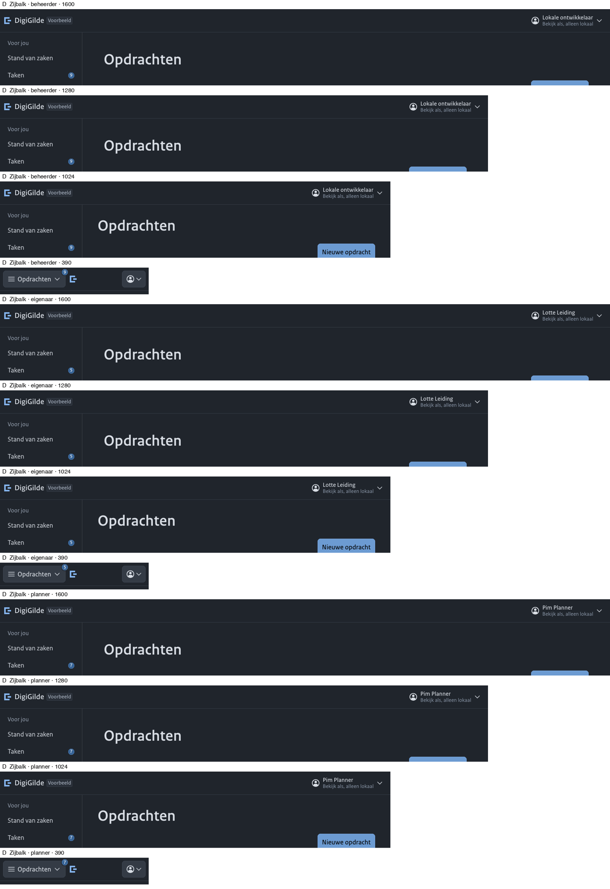
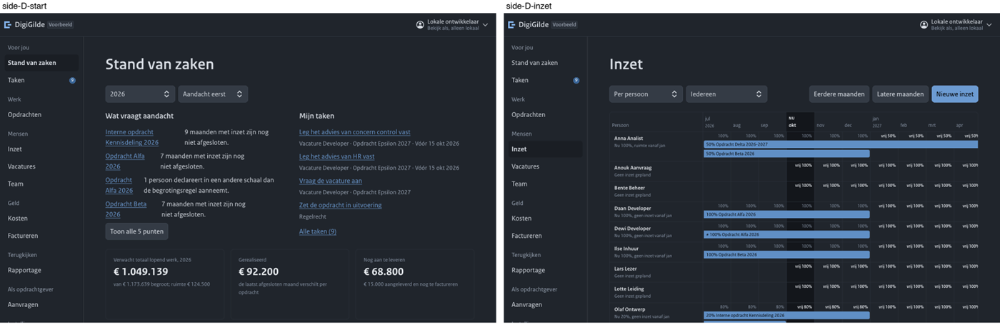

- Beter: alles zichtbaar, met groepskoppen, zonder iets weg te stoppen.
- Slechter: de zijbalk kost 216 pixels. Op 1280 toont het planbord daardoor twee maanden minder. Dat is precies waarom ADR 0033 voor een bovenbalk koos, en het beeld bevestigt het. Een inklapbare zijbalk lost dat op tegen de prijs van pictogrammen zonder woord, en het designsysteem zegt: tekst gaat voor. De groepen lossen ook de overlap niet op; ze geven die alleen een kopje.

### E. Zeven plekken

Start, Taken, Opdrachten, Team (Mensen, Inzet), Vacatures, Financieel (Kosten, Factureren), Rapportage.

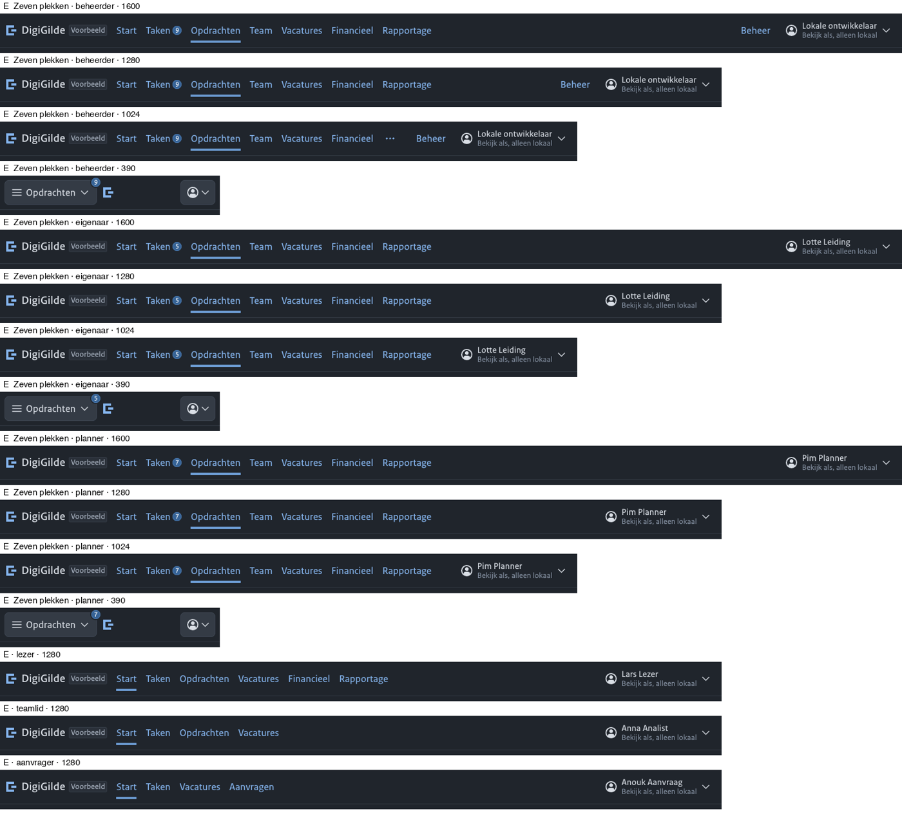
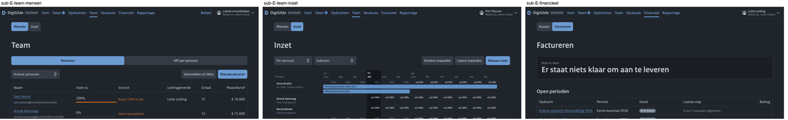
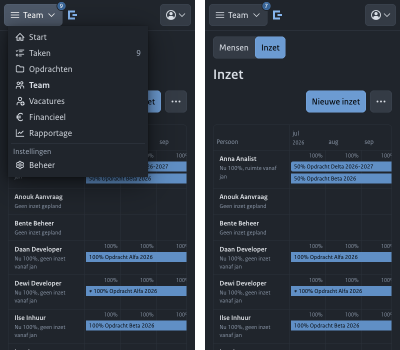

- Beter: zeven woorden, alles past op 1280 voor iedereen. Op 1024 valt alleen bij de beheerder Rapportage weg. De twee duidelijke overlappen zijn weg. Taken en Vacatures, waar het werk heen gaat, houden hun plek. Het smalle menu telt acht regels in plaats van twaalf.
- Slechter: de planner klikt één keer extra naar het planbord, of zet een bladwijzer. Twee onderdelen krijgen een tweede balk.

### Wie ziet wat, in E

| Lezer | Onderdelen |
|---|---|
| Beheerder | Start, Taken, Opdrachten, Team, Vacatures, Financieel, Rapportage, Beheer |
| Eigenaar of manager | Start, Taken, Opdrachten, Team, Vacatures, Financieel, Rapportage |
| Planner, leidinggevende | Start, Taken, Opdrachten, Team, Vacatures |
| Lezer | Start, Taken, Opdrachten, Vacatures, Financieel, Rapportage |
| Teamlid | Start, Taken, Opdrachten, Vacatures |
| Aanvrager of tekenbevoegde | Start, Taken, Vacatures, Aanvragen |

## Advies

**Variant E.**

De twee sterkste argumenten ertegen:

1. **Het planbord is het dagelijkse scherm van de planner en verdwijnt uit de balk.** Het staat dan onder een woord, Team, dat de planner misschien niet zoekt. Als planners zeggen dat ze het bord als hun thuis zien, is C beter, of moet Inzet de eerste weergave onder Team worden.
2. **De tweede balk rekt de regel uit ADR 0033 op.** Die zegt: tabs voor de kanten van één ding dat openstaat, een overzichtspagina voor losse pagina's. Mensen en inzet zijn twee kanten van hetzelfde, dat past. Kosten en Factureren zijn twee losse pagina's over geld; daar is de tweede balk een gemak, geen noodzaak. Een overzichtspagina Financieel met beide als blok is de zuivere vorm.

## Het antwoord per onderdeel

| Onderdeel | In het menu | Waarom | Waar het anders staat |
|---|---|---|---|
| Stand van zaken | Ja, als "Start" | Het begin, voor iedereen | |
| Taken | Ja, met het getal | Dagelijks, voor iedereen | |
| Opdrachten | Ja | Het ding waar het werk in zit | |
| Team | Ja | De mensen; wekelijks voor planner, leidinggevende en beheerder | |
| Inzet | Nee, niet als eigen onderdeel | Hetzelfde ding als Team, over de tijd | Tweede weergave onder Team; ook de tab Bemensing van een opdracht |
| Vacatures | Ja | Een eigen ding met een eigen verloop; de helft van de taken eindigt er | |
| Kosten | Nee, niet als eigen onderdeel | Maandelijks; hoort bij geld | Weergave onder Financieel |
| Factureren | Nee, niet als eigen onderdeel | Per maand of kwartaal; hoort bij geld | Weergave onder Financieel; ook via de taak en de tab van de opdracht |
| Financieel | Ja, nieuw | Eén plek voor geld over opdrachten heen; hetzelfde woord als de tab van een opdracht | |
| Rapportage | Ja | Het hoofdscherm van de lezer | |
| Aanvragen | Ja, alleen met de rol aanvrager of tekenbevoegde | Een andere rol; de beheerder van een opdrachtnemer heeft er niets aan | Voor de beheerder: via Beheer |
| Beheer | Ja, rechts apart | Geen dagelijks werk | |
| Goedkeuren van offertes | Nee | Komt als taak | Link "Offertes ter goedkeuring" op Taken, zodat de lijst geen wees is |
| Bewijs controleren | Nee | Zelden, vanuit een bewijs | Ontvangstbewijs en bewijspagina |
| Open rollen | Nee | Een filter, geen plek | Weergave binnen Vacatures |
| Standaardteksten, vacatureformulier en taalmodel | Nee | Instellingen | Beheer; weg uit de actiebalk van Vacatures |
| Tarieven, Offertes, Afzender, Organisaties, Koppelingen, Rollen, Wies, Activiteit | Nee | Instellingen | Beheer |
| Beveiliging, Meldingen, Installeer grip, Mijn gegevens | Nee | Over jezelf | Accountmenu |

## Bouwplan voor E

Ongeveer een halve dag. Geen adres verandert, dus geen doorverwijzingen.

1. `frontend/src/routes.ts`: Team krijgt Inzet als tweede pagina, Financieel vervangt Kosten en Factureren, "Stand van zaken" krijgt het label "Start", Aanvragen niet meer standaard voor de beheerder.
2. `frontend/src/AppRoutes.tsx`: de schermen van het hoogste niveau hangen nu aan de lijst van het menu. Een pagina die uit het menu gaat, verliest zo haar adres. Dat moet los van elkaar.
3. Een tweede balk voor de pagina's van een onderdeel, in de schil of op de pagina zelf. Het onderdeel met tabs dat een opdracht al gebruikt, volstaat.
4. De actiebalk van Vacatures: "Open rollen" wordt een weergave, de twee instellingen gaan naar Beheer.
5. Een link naar de lijst Goedkeuren op Taken, en een link naar Factureren op de startpagina bij wat aandacht vraagt.
6. Tests: de lijsten in `routes.test.tsx`, de test van de balk, de test per lezer.
7. Een aanvulling op ADR 0033 over de tweede balk, als het besluit valt.

## Niet vast te stellen zonder gebruikers

De frequenties zijn afgeleid, niet gemeten. Vraag drie tot vijf mensen per rol:

1. Welke pagina open je als eerste op een werkdag? En welke drie het vaakst?
2. Aan planners: is het planbord je thuis, of de lijst van mensen? Zoek je het onder "Team"?
3. Aan eigenaren: ga je naar Kosten en Factureren uit jezelf, of alleen als een taak of een collega van financiën erom vraagt?
4. Gebruik je de startpagina, of ga je direct naar Taken?
5. Onder welk woord zoek je het geld: Financieel, Geld, Facturen?
6. Aan de beheerder van een instantie die ook opdrachtgever is: wil je Aanvragen altijd zien?

Niet onderzocht: de lichte modus, de balk bij 200% zoom, en een instantie waarin de rol van opdrachtgever de hoofdzaak is.
