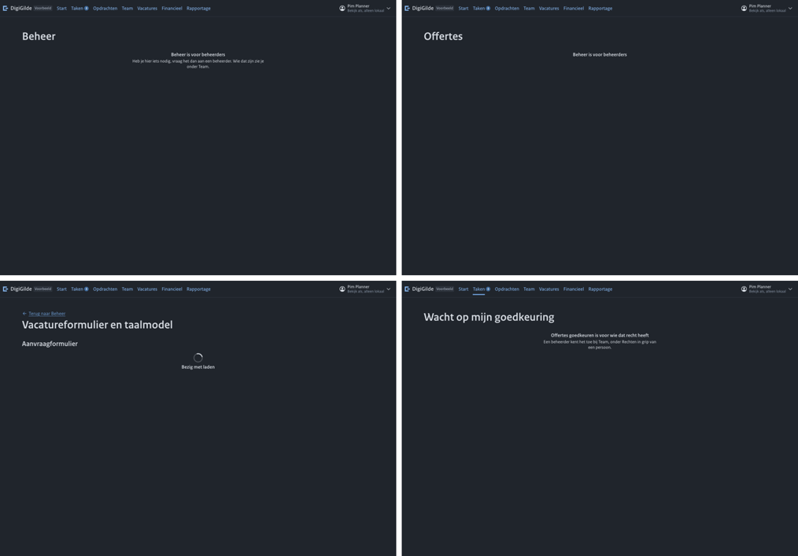
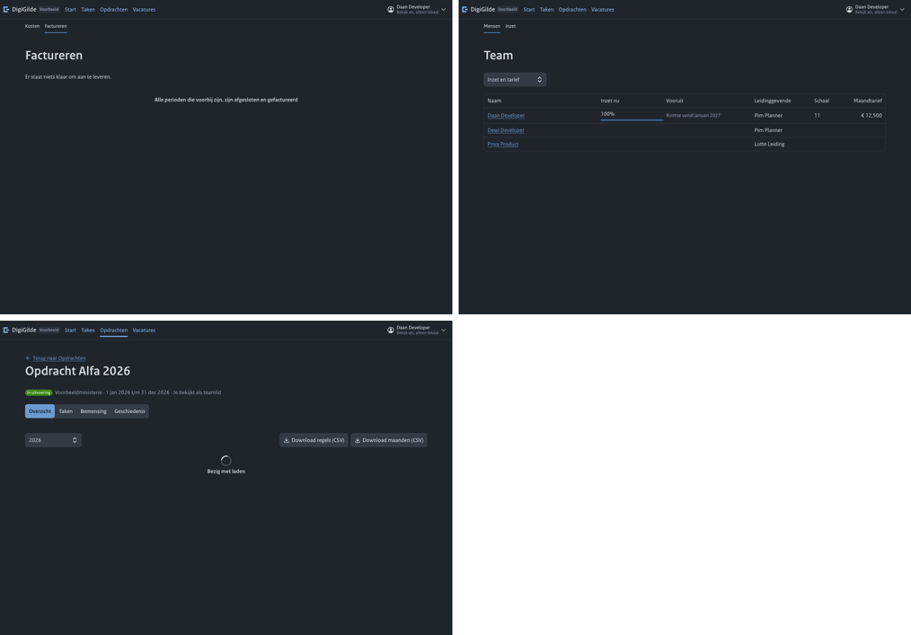
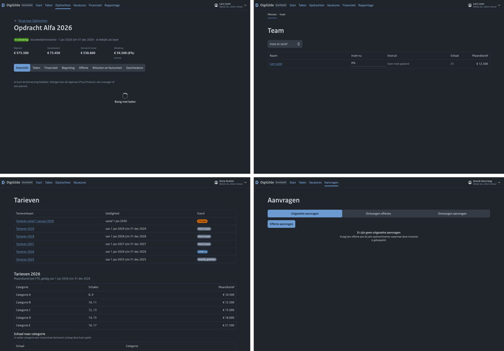
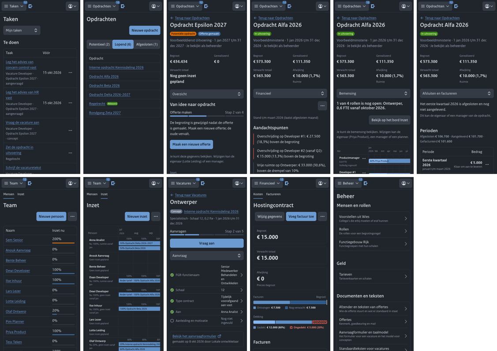
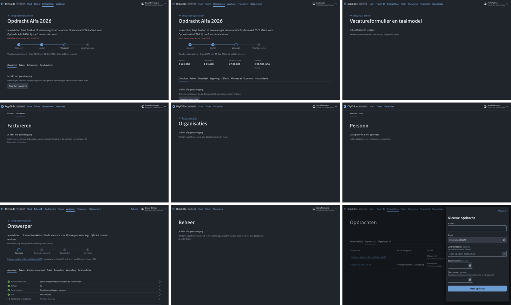

# Rondgang door de hele interface

Stand: commit `53005b7` op de werkbranch, 8 oktober 2026. Gedaan in een eigen kopie (eigen database, eigen servers), met een echte browser die klikt en typt, als de verschillende voorbeeldpersonen. Deze ronde vindt en beschrijft; er is niets aan de code gewijzigd.

## Hoe ver elke reis kwam

| Reis | Stand |
|---|---|
| 1. Opdracht winnen | Doorlopen tot en met "in uitvoering": opdracht, begroting (drie soorten regels), offerte als brief met een eigen tekst en twee concepten van het taalmodel, pdf bekeken, aangeboden als document en met een tekenlink, getekend als de uitgenodigde, bewijs gedownload en gecontroleerd. Niet gedaan: interne goedkeuring, mail van de tekenlink, "Herschrijf selectie", een node uit het corpus (alleen het paneel gezien) |
| 2. Van gedachten veranderen | Deels: begroting gewijzigd na akkoord en de signalen gelezen; een beheerder die de nieuwe offerte niet mag maken. Niet gedaan: nieuwe offerte na wijziging, afwijzen als opdrachtgever |
| 3. Bemensen | Iemand ingezet vanaf de tab Bemensing, promotie midden in een maand met de gevolgen vooraf, oorzaak teruggevonden in Financieel en Begroting. Niet gedaan: plannen vanaf het bord, inkorten en beëindigen |
| 4. Werven | Deels: aanvraag voorbereid, motivatie geschreven, standaardtekst genomen, aanvraagformulier gemaakt en bekeken. Niet gedaan: aanvragen, advies en akkoord, beoordelen van de tekst, publiceren, vervullen, de variant met een kandidaat |
| 5. Uitvoeren en factureren | Doorlopen: maand aangepast en afgesloten, kwartaal aangeleverd met factuuradres, factuurverzoek bekeken, factuur vastgelegd, naverrekening door een late promotie |
| 6. Kosten en tarieven | Niet gedaan, alleen bekeken in de rondes langs alle pagina's |
| 7. De dag van de beheerder | Alleen: afzender en standaardteksten overgenomen van het profiel. De rest niet gedaan |
| 8. Alle anderen | Elke pagina geopend als planner, eigenaar, lezer, teamlid, persoon zonder rechten en aanvrager, met diepe links naar tabs die zij niet hebben. Niet gedaan: terugknop, herladen na opslaan, twee tabbladen tegelijk, de kant van de opdrachtgever |
| 9. Smal en licht | Elke pagina op 390 breed en in het lichte thema geopend als beheerder; twaalf smalle en acht lichte pagina's bekeken. Geen pagina schuift zijwaarts |

## Telling

42 bevindingen: 8 kapot, 19 verwarrend, 15 ruw.

## De vijftien ergste

- **F009** (kapot), reis 1, vaste begrotingsregel: het jaar staat standaard op 2026 (het huidige jaar); de begroting krijgt "Subtotaal 2026 € 6.000" buiten de looptijd, zonder waarschuwing
- **F014** (kapot), reis 1, offertebrief (pdf): Leveringsvoorwaarden punt 6 zegt "Deze offerte is gebaseerd op de tarieven van 2026"; het jaar volgt het moment van maken, niet de tarieven in de offerte
- **F017** (kapot), reis 1, offerte aanbieden: de offerte is aangeboden "Als document"; de drie manieren staan als tekstregels zonder zichtbare keuze of selectie, dus je ziet niet dat er al een gekozen is
- **F023** (kapot), reis 8, /vacatures/beheer: de pagina blijft op "Bezig met laden" staan; de server antwoordt 403 en het scherm zegt dat niet
- **F026** (kapot), reis 8, /factureren: de pagina zegt "Er staat niets klaar om aan te leveren. Alle perioden die voorbij zijn, zijn afgesloten en gefactureerd", wat niet waar is; hij mag het alleen niet zien
- **F027** (kapot), reis 8, diepe link naar Financieel: jaarkeuze en twee knoppen "Download ... (CSV)" staan er, daaronder eindeloos "Bezig met laden"; de server antwoordt 403
- **F032** (kapot), reis 8, diepe link naar Bemensing: er staat "Je kunt de bemensing bekijken. Wijzigen kan de eigenaar ...", daaronder eindeloos "Bezig met laden"; de tab "Overzicht" is gemarkeerd
- **F033** (kapot), reis 8, /beheer/tarieven: alle tarievenkaarten met de maandtarieven per categorie en de schalen per categorie staan er, ook de conceptkaart voor 2030, voor iemand die volgens het toegangsmodel geen geld ziet; de Beheer-pagina zelf zegt "Beheer is voor beheerders"
- **F004** (verwarrend), reis 1, nieuwe opdracht: het formulier vraagt geen looptijd en Overzicht noemt de ontbrekende looptijd niet; later blijken begrotingsregels de looptijd van de opdracht te volgen
- **F006** (verwarrend), reis 1, begrotingsregel: schaal en rol worden stil vervangen door die van de persoon (C werd B); er staat nergens dat de eerdere keuze is overschreven
- **F008** (verwarrend), reis 1, begrotingsregel, rol kiezen: alleen "Productmanager" wordt aangeboden; "Product owner" en "Software engineer" vinden niets, want de rollenlijst kent ze als "po" en "Developer" en zoekt niet op de andere namen die de standaardteksten wel kennen (Ook: PO, Product owner)
- **F010** (verwarrend), reis 1, offerte schrijven: alle onderdelen staan op "Leeg", ook Leveringsvoorwaarden; niets zegt dat de standaardteksten en de afzender van de organisatie ontbreken en dat een beheerder die eerst moet instellen
- **F011** (verwarrend), reis 1, offerte schrijven: het onderdeel blijft open staan met dezelfde knop "Bewaar"; alleen het kleine woord onder de kop wisselt naar "Zelf geschreven"; er is geen bevestiging en het volgende onderdeel opent niet
- **F013** (verwarrend), reis 1, offerte schrijven: het onderdeel blijft "Niet in deze offerte"; niets zegt of de tekst bewaard is en hoe het onderdeel alsnog meedoet
- **F015** (verwarrend), reis 1, offertebrief (pdf): de brief drukt de kop "Contactpersoon ODI

## Bedragen die over schermen heen zijn nagerekend

| Keten | Gerekend | Op de schermen |
|---|---|---|
| Begroting naar kop | 0,8 fte × 12 × € 13.125 = € 126.000; 0,5 fte × 12 × € 18.900 = € 113.400; vast € 6.000; samen € 245.400 | Begroting, kop van de opdracht: € 245.400 |
| Begroting naar offerte en brief | dezelfde drie regels | Offertekaart € 245.400; brief: regels € 126.000, € 113.400, € 6.000, totaal € 245.400; tekenpagina hetzelfde |
| Promotie midden in een maand | jan en feb 2 × 0,8 × 13.125 = 21.000; maart 0,8 × (13.125 × 14/31 + 15.750 × 17/31) = 11.651,61; apr t/m dec 9 × 0,8 × 15.750 = 113.400; samen € 146.051,61 | Financieel 2027, verwacht totaal van de regel: € 146.052; overschrijding € 20.052 |
| Maand afsluiten | maart gepland 12.500 + 9.000 + 14.400 = 35.900; met 40 in plaats van 60 procent: 32.900; kwartaal 35.900 + 32.900 + 32.900 = 101.700 | Tab: € 101.700; factuurverzoek (pdf): € 101.700 met dezelfde regels |
| Naverrekening | schaal 11 naar 13 per 1 februari: 2 maanden × (15.000 − 12.500) = € 5.000 | Tab en Financieel: € 5.000 |
| Begroting na akkoord | 0,1 fte × 12 × € 18.900 = € 22.680 | Overzicht: "€ 22.680 hoger dan de getekende offerte" |

Alle zes ketens kloppen. Wat niet klopt zijn jaren en standen, niet de sommen: een vaste regel op het verkeerde jaar (F009), het verkeerde tariefjaar in de brief (F014), Financieel dat op het verkeerde jaar opent (F025).

## Toegang

Geen bedrag, schaal of kostprijs van een ander gevonden bij het teamlid, de persoon zonder rechten of de aanvrager, op geen van de 47 adressen, ook niet in de feed en de geschiedenis. Twee dingen wel:

- **Tarieven zijn voor iedereen leesbaar** (F033): alle kaarten met de bedragen per categorie, ook het concept. Dat is geen persoonsgegeven, maar het toegangsmodel zegt dat een teamlid geen geld ziet. Dit vraagt een besluit.
- **Tabs en pagina's die je niet hebt, blijven hangen of beweren iets onjuists** (F023, F026, F027, F032): de server weigert terecht, het scherm zegt het niet.

De voorbeeldplanner is ook manager van opdrachten en leidinggevende, dus wat hij aan bedragen ziet, mag hij zien. Een zuivere planner is niet met de hand nagelopen; daarvoor ontbreekt een voorbeeldpersoon.

## Fouten in de browser

Geen enkele scriptfout op een pagina. Alle geweigerde verzoeken waren 403 of 404 voor iemand zonder recht, plus één 502 op de pagina met voorstellen uit Wies (Wies was in deze opstelling niet bereikbaar; de pagina zegt dat). Waar een 403 niet werd uitgelegd, staat dat bij de bevindingen (F023, F027, F032).

## Alle bevindingen, per gebied

### Opdrachten en start

| Nr | Ernst | Waar, als wie | Wat er gebeurde | Wat je verwacht | Vermoedelijke plek |
|---|---|---|---|---|---|
| F009 | Kapot | reis 1, vaste begrotingsregel; eigenaar; vaste regel "Licenties" toegevoegd op een opdracht die van 1 jan t/m 31 dec 2027 loopt, jaar niet aangeraakt | het jaar staat standaard op 2026 (het huidige jaar); de begroting krijgt "Subtotaal 2026 € 6.000" buiten de looptijd, zonder waarschuwing | standaard het eerste jaar van de looptijd, en een jaar buiten de looptijd weigeren of melden | features/assignments/BudgetEditor.tsx en services/assignments (validatie) |
| F027 | Kapot | reis 8, diepe link naar Financieel; teamlid; /opdrachten/<id>/financieel geopend (tab staat niet in zijn tabs) | jaarkeuze en twee knoppen "Download ... (CSV)" staan er, daaronder eindeloos "Bezig met laden"; de server antwoordt 403 | geen acties tonen en zeggen dat dit deel niet voor deze lezer is | features/assignments/tabs/FinanceTab.tsx (403 afhandelen), AssignmentLayout (tab die je niet hebt) |
| F032 | Kapot | reis 8, diepe link naar Bemensing; lezer; /opdrachten/<id>/bemensing geopend (tab staat niet in zijn tabs) | er staat "Je kunt de bemensing bekijken. Wijzigen kan de eigenaar ...", daaronder eindeloos "Bezig met laden"; de tab "Overzicht" is gemarkeerd | zeggen dat dit deel niet voor deze lezer is; geen zin die het tegendeel beweert | features/assignments/AssignmentLayout.tsx (route zonder recht), StaffingTab (403) |
| F004 | Verwarrend | reis 1, nieuwe opdracht; eigenaar; opdracht gemaakt met naam en opdrachtgever | het formulier vraagt geen looptijd en Overzicht noemt de ontbrekende looptijd niet; later blijken begrotingsregels de looptijd van de opdracht te volgen | looptijd in het formulier of als eerste stap benoemd | features/assignments (nieuw formulier, OverviewTab) |
| F006 | Verwarrend | reis 1, begrotingsregel; eigenaar; schaal 12 en 13 gekozen, daarna beoogde persoon gekozen | schaal en rol worden stil vervangen door die van de persoon (C werd B); er staat nergens dat de eerdere keuze is overschreven | een regel "Schaal en rol volgen de beoogde persoon" op het moment van kiezen | features/assignments/BudgetEditor.tsx |
| F021 | Verwarrend | reis 1, Overzicht na akkoord; eigenaar; de opdrachtgever heeft getekend; Overzicht geopend | de stappenbalk is weg en de pagina biedt geen volgende stap; "in uitvoering zetten" zit alleen in het menu met drie puntjes, terwijl er wel een taak "Zet de opdracht in uitvoering" bestaat | de volgende stap als hoofdknop in de kop zolang de opdracht op "Akkoord" staat | features/assignments/tabs/OverviewTab.tsx, standing.ts |
| F022 | Verwarrend | reis 1, context toevoegen; eigenaar; "Voeg een node toe" | het paneel vraagt een kale URI ("te vinden op de pagina van de node in het corpus"); er is geen zoeken of kiezen, en niets zegt of het corpus bereikbaar is (in deze opstelling niet vastgesteld) | zoeken in het corpus, met de URI als uitweg | features/nodes |
| F025 | Verwarrend | reis 3, Financieel; eigenaar; Financieel geopend van een opdracht die helemaal in 2027 ligt | de tab staat op 2026 ("Stand per begrotingsregel, 2026") en toont nullen voor de personeelsregels; alleen de vaste regel met het verkeerde jaar heeft een bedrag | het eerste jaar van de looptijd, of "hele looptijd" als begin | features/assignments/tabs/FinanceTab.tsx |
| F037 | Verwarrend | reis 2, Overzicht potentiële opdracht; beheerder (mag de offerte niet maken); Overzicht geopend van een opdracht waarvan de begroting na de offerte is gewijzigd | de hoofdknop "Maak een nieuwe offerte" staat er ook voor wie dat niet mag, naast de regel "Je kunt deze gegevens bekijken"; de klik eindigt op de tab Offerte zonder enige actie | voor wie niet mag: de zin over wat er speelt en wie het kan doen, zonder knop | features/assignments/tabs/OverviewTab.tsx (standing: actie alleen voor wie mag) |
| F005 | Ruw | reis 1, Overzicht; eigenaar; nieuwe opdracht | "Wijzig gegevens" en het menu zweven rechts boven één feit ("Soort"), los van waar ze bij horen; de lege Context toont een gecentreerde zin boven een links uitgelijnde knop | acties bij hun blok, lege staat links uitgelijnd | features/assignments/tabs/OverviewTab.tsx |
| F007 | Ruw | reis 1, begrotingsregel; eigenaar; formulier geopend op opdracht zonder looptijd | in het formulier zit een tweede formulier met eigen knop "Bewaar de looptijd van de opdracht", en "Afwijkende periode" is kale tekst; de uitleg bij Schaal noemt "Tarieven 2026" terwijl de periode nog onbekend is | looptijd vooraf vragen; een knopvorm; tarief pas noemen als de periode bekend is | features/assignments/BudgetEditor.tsx, PeriodChoice.tsx |
| F040 | Ruw | reis 9, Financieel op 390; beheerder; tab Financieel op smal scherm | een losse knop met drie puntjes staat rechts boven de tekst, zonder naam of context | de acties in één balk met de jaarkeuze | features/assignments/tabs/FinanceTab.tsx |

### Vacatures, team, taken

| Nr | Ernst | Waar, als wie | Wat er gebeurde | Wat je verwacht | Vermoedelijke plek |
|---|---|---|---|---|---|
| F023 | Kapot | reis 8, /vacatures/beheer; planner (geen beheerder); pagina "Vacatureformulier en taalmodel" geopend | de pagina blijft op "Bezig met laden" staan; de server antwoordt 403 en het scherm zegt dat niet | de melding "Beheer is voor beheerders", zoals op de andere beheerpagina's | features/vacancies (setup page, foutafhandeling 403) |
| F034 | Verwarrend | reis 4, vacature aanvragen; aanvrager (eigenaar van de opdracht); type contract ingevuld; "Aanleiding en motivatie" staat op "Nog niet ingevuld" | stap 1 "Aanvraag voorbereiden" is afgerond en de hoofdknop is "Vraag aan", terwijl de motivatie die op het aanvraagformulier hoort nog leeg is | de motivatie hoort bij de voorbereiding; "Vraag aan" pas daarna, of met de waarschuwing erbij | features/vacancies/steps.ts, services/vacancies (voorwaarde voor aanvragen) |
| F036 | Verwarrend | reis 4, aanvraagformulier; aanvrager; motivatie geschreven (stand "In de maak"), daarna "Maak aanvraagformulier" | de tab Aanvraag toont "Aanleiding en motivatie (concept, nog vaststellen): Nog niet ingevuld" en het formulier wordt zonder waarschuwing gemaakt met een leeg vak 2 | zeggen "De motivatie is nog niet vastgesteld en staat niet op het formulier", met de knop om vast te stellen | features/vacancies (Aanvraag-tab, RequestFormSection) |
| F041 | Verwarrend | reis 4, nieuwe vacature; eigenaar; "Nieuwe vacature" terwijl Bemensing van dezelfde opdracht zegt "1 van 4 rollen is nog open: Ontwerper" | de open rol staat niet in de keuzelijst (er bestaat al een conceptvacature voor), en het paneel zegt dat niet; je ziet alleen ingevulde rollen | bij de rol noemen "er loopt al een vacature" met een link | features/vacancies/VacanciesPage.tsx (CreateSheet), GET unfilled-roles |

### Offerte, tekenen, factureren, kosten, tarieven

| Nr | Ernst | Waar, als wie | Wat er gebeurde | Wat je verwacht | Vermoedelijke plek |
|---|---|---|---|---|---|
| F017 | Kapot | reis 1, offerte aanbieden; eigenaar; paneel "Offerte aanbieden" geopend en direct op "Bied aan" geklikt, zonder iets te kiezen | de offerte is aangeboden "Als document"; de drie manieren staan als tekstregels zonder zichtbare keuze of selectie, dus je ziet niet dat er al een gekozen is | keuzerondjes met een zichtbare selectie, geen standaard, en "Bied aan" pas na een keuze | features/quotes/OfferSheet.tsx |
| F026 | Kapot | reis 8, /factureren; teamlid zonder geldrechten; adres geopend (staat niet in zijn menu) | de pagina zegt "Er staat niets klaar om aan te leveren. Alle perioden die voorbij zijn, zijn afgesloten en gefactureerd", wat niet waar is; hij mag het alleen niet zien | "Dit is niet voor jou" met wie het wel ziet | features/billing/BillingPage.tsx (lege lijst door rechten onderscheiden van echt leeg; feit van de server) |
| F033 | Kapot | reis 8, /beheer/tarieven; persoon zonder rechten, teamlid, aanvrager; adres geopend | alle tarievenkaarten met de maandtarieven per categorie en de schalen per categorie staan er, ook de conceptkaart voor 2030, voor iemand die volgens het toegangsmodel geen geld ziet; de Beheer-pagina zelf zegt "Beheer is voor beheerders" | besluiten wie tarieven mag lezen en dat afdwingen op de server; nu leest iedereen ze | backend api/routes/rates.py (leesrecht), features/rates |
| F010 | Verwarrend | reis 1, offerte schrijven; eigenaar; schrijfpagina geopend in een instantie waar de afzender en standaardteksten nog niet zijn ingesteld | alle onderdelen staan op "Leeg", ook Leveringsvoorwaarden; niets zegt dat de standaardteksten en de afzender van de organisatie ontbreken en dat een beheerder die eerst moet instellen | een regel "De afzender en standaardteksten zijn nog niet ingesteld" met wie dat kan doen | features/quotes/QuoteDraftPage.tsx, GET quote-draft (feit toevoegen) |
| F011 | Verwarrend | reis 1, offerte schrijven; eigenaar; tekst van Inleiding getypt en "Bewaar" geklikt | het onderdeel blijft open staan met dezelfde knop "Bewaar"; alleen het kleine woord onder de kop wisselt naar "Zelf geschreven"; er is geen bevestiging en het volgende onderdeel opent niet | na bewaren het onderdeel sluiten met "Bewaard" en het volgende lege onderdeel aanbieden | features/quotes/QuoteDraftPage.tsx |
| F013 | Verwarrend | reis 1, offerte schrijven; eigenaar; bij "Scope" (staat op "Niet in deze offerte") op "Schrijf" geklikt, een concept laten opstellen en "Stel vast" geklikt | het onderdeel blijft "Niet in deze offerte"; niets zegt of de tekst bewaard is en hoe het onderdeel alsnog meedoet | schrijven zet het onderdeel in de offerte, of de knop heet "Neem op in de offerte" | features/quotes/QuoteDraftPage.tsx |
| F015 | Verwarrend | reis 1, offertebrief (pdf); eigenaar; offerte gemaakt zonder contactpersoon en ondertekenaar onder Beheer | de brief drukt de kop "Contactpersoon ODI | DigiGilde" zonder persoon eronder en een ondertekening zonder naam; het maken wordt niet tegengehouden en de schrijfpagina noemt het niet als probleem | quote-sheet (pagina 3) |
| F018 | Verwarrend | reis 1, offertekaart; eigenaar; offerte aangeboden als document | de kaart zegt "Aangeboden", het label in de kop van de opdracht zegt nog "Offerte gemaakt" | één stand, dezelfde woorden | features/assignments (statuslabel in ThingHead) of services: status van de opdracht na aanbieden |
| F028 | Verwarrend | reis 5, maand afsluiten; eigenaar; in "Klopt dit met wat er in maart is gewerkt?" het percentage van één persoon van 60 naar 40 gezet | het bedrag in die rij blijft € 9.000 (het geplande bedrag) tot na het afsluiten; pas daarna blijkt de maand € 32.900 in plaats van € 35.900 | het bedrag en het maandtotaal rekenen mee met het percentage, vóór het afsluiten | features/month-close (maandpaneel; voorvertoning van de server) |
| F030 | Verwarrend | reis 5, factuur vastleggen; eigenaar; factuur van € 101.600 vastgelegd op een levering van € 101.700 | de pagina toont beide bedragen in de kopregel maar meldt het verschil van € 100 nergens als punt om naar te kijken | een regel bij de periode: "€ 100 minder gefactureerd dan aangeleverd" | features/month-close, GET billing (signaal) |
| F031 | Verwarrend | reis 5, naverrekening; eigenaar; na de factuur een promotie met terugwerkende kracht vastgelegd (februari en maart waren afgesloten, aangeleverd en gefactureerd) | de kaart bovenaan zegt "Het eerste kwartaal 2026 is klaar: € 5.000. Alle maanden zijn afgesloten. Maak het factuurverzoek", en de periode springt van "Gefactureerd, factuur F-2026-0412" terug naar "Klaar om aan te leveren"; dat er al gefactureerd is en dat dit een naverrekening is, staat alleen in kleine tekst | "Naverrekening over het eerste kwartaal: € 5.000 aan te leveren", met de eerdere factuur zichtbaar bij de periode | features/month-close (kaart en periodestand), services billing |
| F012 | Ruw | reis 1, offerte schrijven; eigenaar; pagina na het overnemen van het profiel | drie onderdelen staan in de lijst als "Niet in deze offerte" (Scope, Beoogde resultaten, Raakvlakken en samenwerking), tussen de onderdelen die wel meedoen | wat niet meedoet onderaan of achter "Voeg een onderdeel toe" | features/quotes/QuoteDraftPage.tsx |
| F016 | Ruw | reis 1, offerte maken; eigenaar; "Maak offerte" met leeg veld "Geldig tot en met" | de offerte wordt gemaakt zonder geldigheid, zonder vraag of dat de bedoeling is | een voorstel (bijvoorbeeld 30 dagen) of een bevestiging | features/quotes |
| F019 | Ruw | reis 1, offertekaart; eigenaar; aangeboden als document | de regel luidt "Meegegeven, wacht op het getekende exemplaar"; "meegegeven" is geen gewoon woord voor wat er gebeurde | "Als document verstuurd; wacht op het getekende exemplaar" | features/quotes/offers.ts |

### Gedeelde bouwstenen

| Nr | Ernst | Waar, als wie | Wat er gebeurde | Wat je verwacht | Vermoedelijke plek |
|---|---|---|---|---|---|
| F001 | Ruw | reis 1, nieuwe opdracht; eigenaar; leeg verstuurd, daarna naam ingevuld | de melding "Geef de opdracht een naam." blijft staan terwijl de naam er staat, tot opnieuw versturen | melding verdwijnt zodra het veld is ingevuld | features/assignments (formulier nieuwe opdracht) of @/ui/layout FormSheet |
| F002 | Ruw | reis 1, opdrachtenlijst; eigenaar; lijst geopend | de weergaven Potentieel/Lopend/Afgesloten zijn een gevulde blauwe tab direct onder de hoofdknop (bekend, herstel loopt in de werkmap) | streep onder de gekozen weergave | @/ui/layout TabNav |
| F003 | Ruw | reis 1, kop nieuwe opdracht; eigenaar; opdracht net gemaakt | de kop toont vier keer "€ 0" en bij Afwijking "Geen ruimte", terwijl er nog geen begroting is | geen kerncijfers tot er een begroting is, of één regel "Nog geen begroting" | @/ui/layout KeyFigures of features/assignments/AssignmentLayout |
| F024 | Ruw | reis 8, beheerpagina's zonder recht; planner; /beheer, /beheer/offertes, /goedkeuren | drie verschillende vormen voor dezelfde boodschap (twee regels, één regel, andere tekst), gecentreerd onder een links uitgelijnde titel | één onderdeel voor "dit is niet voor jou", links uitgelijnd, met wie het wel kan | @/ui/layout (EmptyNotice of een NoAccess-blok) |
| F038 | Ruw | reis 1, offertekaart getekend; eigenaar; getekende offerte bekeken | de stappenbalk meldt in zijn tekst "Gemaakt, stap 1 van 3" terwijl alle drie de stappen zijn afgerond (de korte vorm voor smal scherm en hulptechnologie) | "Getekend, stap 3 van 3" of geen balk meer na het besluit | @/ui/StepBar (positie als alles klaar is), features/quotes/QuoteCard.tsx |
| F039 | Ruw | reis 3, persoonspagina; beheerder; persoon met een tariefverschil bekeken | in de tijdbalk begint het label met "Ander tarief · 100% Opdracht Alfa 2026"; het signaal staat als tekst vóór de naam van de opdracht in de balk | het signaal als teken naast de balk, de balk zelf alleen percentage en opdracht | @/ui/timeline |
| F042 | Ruw | algemeen, datumkiezer; iedereen; een datumveld geopend | de jaarlijst van de kiezer begint bij 1906 | jaren rond de looptijd | designsysteem (datumveld): min en max meegeven vanuit @/ui |

### Achterkant

| Nr | Ernst | Waar, als wie | Wat er gebeurde | Wat je verwacht | Vermoedelijke plek |
|---|---|---|---|---|---|
| F014 | Kapot | reis 1, offertebrief (pdf); eigenaar; offerte gemaakt voor 2027 met tarieven van 2027 (13.125 en 18.900) | Leveringsvoorwaarden punt 6 zegt "Deze offerte is gebaseerd op de tarieven van 2026"; het jaar volgt het moment van maken, niet de tarieven in de offerte | het jaar of de jaren van de tarieven die in de kostentabel staan | backend: services/quote_drafts.py of quote_sender.py (plaatshouder {jaar}) |
| F008 | Verwarrend | reis 1, begrotingsregel, rol kiezen; eigenaar; "Product" getypt | alleen "Productmanager" wordt aangeboden; "Product owner" en "Software engineer" vinden niets, want de rollenlijst kent ze als "po" en "Developer" en zoekt niet op de andere namen die de standaardteksten wel kennen (Ook: PO, Product owner) | één rollenlijst voor begroting, vacatures en standaardteksten | backend: rolcatalogus (seed of lader), grip/data/vacancy_texts |
| F035 | Verwarrend | reis 4, standaardtekst; aanvrager; "Begin met de standaardtekst" voor een vacature op Opdracht Alfa 2026 | de vacaturetekst krijgt de kop "Dit doe je bij Opdracht Alfa 2026": de interne naam van de opdracht staat als kop in een tekst die naar buiten gaat | een plaatshouder voor het team of product in gewone woorden, niet de naam van de opdracht | backend services/vacancies/library.py (plaatshouders), data/vacancy_texts |
| F020 | Ruw | reis 1, bewijs controleren; ondertekenaar; bewijspakket geüpload | de uitkomst spreekt van "vingerafdruk", elders heet hetzelfde "echtheidskenmerk" | één woord | backend grip/proof/verify.py (zinnen) |
| F029 | Ruw | reis 5, factuurverzoek (pdf); eigenaar; eerste kwartaal met drie rollen aangeleverd | één voetregel ("Aangeleverd op ... Dit is geen factuur. Adres ...") valt alleen op pagina 2; per maand staat geen subtotaal, terwijl het scherm de maandbedragen wel noemt | alles op één pagina voor een kwartaal met een handvol rollen; subtotaal per maand | backend grip/services/billing_document.py |

## Wat goed is en zo moet blijven

- De sommen kloppen overal, ook per dag binnen een maand en bij een naverrekening.
- De oorzaak van een tariefverschil staat in gewone woorden bij de regel ("Gepromoveerd per 15 maart 2027: vanaf dan categorie C, de regel is begroot op B").
- Bemensing biedt alleen de regels van de eigen opdracht en zegt in één zin hoe het staat.
- De promotie toont vooraf wat er verandert.
- Het aanleveren weigert zonder factuuradres en zegt welk veld ontbreekt.
- De offertebrief leest als een brief: briefhoofd, genummerde onderdelen, tabel, voorwaarden, ondertekening, bijlage.
- Het aanvraagformulier ziet eruit als het echte formulier, met de juiste vinkjes.
- Tekenen als uitgenodigde werkt van link tot ontvangstbewijs, en het bewijs controleren geeft een leesbare uitkomst.
- De tekenlink toont een vreemde alleen "Deze offerte staat niet voor je klaar".
- Geen pagina schuift zijwaarts op 390 breed; het lichte thema is leesbaar.
- De schrijfpagina van de offerte zegt hoeveel onderdelen er nog te schrijven zijn en met welk je begint.

## Wat in deze opstelling niet te testen was

- Inloggen via een echte login-dienst: de kopie draait zonder login. Het opnieuw inloggen bij het tekenen is dus niet gezien; het akkoord werd direct vastgelegd.
- Mail en pushmeldingen: er draaide geen postvanger en geen achtergrondproces.
- Het corpus: het paneel om een node te kiezen vroeg om een adres; of zoeken werkt als het corpus bereikbaar is, is niet vastgesteld.
- Een echte telefoon, een geïnstalleerde app en een passkey.
- Twee gekoppelde instanties: de kant van de opdrachtgever met een ontvangen offerte.

Onbekend blijft daarmee: of de tekenstap met een echte login goed terugkeert, of de mail aankomt en leesbaar is, en hoe de pagina's zich houden bij een verlopen sessie.

## Ronde twee

Gedaan na de herstellingen van ronde een, op de werkmap met een eigen database en eigen servers. Doorlopen: reis 2 helemaal (begroting gewijzigd na het aanbieden, nieuwe offerte via de schrijfpagina, de oude vervangen, aangeboden met een tekenlink, afgewezen door de uitgenodigde), reis 6 (kostenpost met een ontvangen en een verwachte factuur en dekking over twee opdrachten met een restant; nieuwe tarievenkaart met verhoging en de voorvertoning van vaststellen) en het bord Inzet als planner (plannen, inkorten, dubbel boeken, beëindigen). Niet gedaan: "Herschrijf selectie" met het lokale taalmodel, interne goedkeuring (vragen, goedkeuren, terugsturen), een bijlage bij een factuur van een kostenpost, en het vaststellen van de nieuwe tarievenkaart zelf.

| Nr | Ernst | Waar, als wie | Wat er gebeurde | Wat je verwacht | Stand |
|---|---|---|---|---|---|
| G001 | Kapot | reis 6, kostenpost; beheerder maakt een kostenpost | de beheerder kreeg een lege lijst begrotingsregels om te laten dekken, en geen manager kon de post zien: niemand kon hem dekken | wie een opdracht beheert ziet een ongedekte kostenpost en laat een eigen regel dekken | Hersteld: toegangsregel, test en `docs/toegang.md` |
| G002 | Verwarrend | reis 2, tab Offerte; eigenaar; begroting gewijzigd na de offerte | de kaart van de oude offerte hield "Bied aan" als hoofdknop, terwijl de kop zei dat er een nieuwe offerte nodig is | de volgende stap van de kaart is de nieuwe offerte | Hersteld |
| G003 | Verwarrend | reis 2, tab Offerte na een afwijzing; eigenaar | de tab opent met "Nieuwe offerte" en "Ga verder met de offerte"; dat de laatste offerte is afgewezen, door wie en waarom, staat niet bovenaan | de afwijzing met de reden bovenaan, daarna de weg naar een nieuwe offerte | Opgelost: de zin in de kop zegt wie afwees, wanneer en waarom, met de stap naar een nieuwe offerte |
| G004 | Ruw | reis 6, kostenpost; afwijking | "€ -1.000" met het woord "Overschrijding" ernaast | het bedrag zonder minteken; het woord zegt de richting | Hersteld |
| G005 | Ruw | reis 6, nieuwe tarievenkaart; beheerder; er staat al een concept voor 2030 | het formulier stelt 1 januari 2031 voor, een tweede concept na het eerste | zeggen dat er al een concept klaarstaat, of dat concept openen | Besloten: het formulier gaat verder na de laatste kaart van elke stand en twee kaarten met dezelfde begindatum worden geweigerd; de tarieven komen nu ook van die laatste kaart (G013) |
| G006 | Ruw | reis 2, schrijfpagina; voorbeeld (pdf) terwijl de afzender geen contactpersoon heeft | het voorbeeld drukt de kop "Contactpersoon" zonder persoon eronder; de pagina noemt het gat wel en het maken wordt geweigerd | in het voorbeeld de lege kop weglaten | Hersteld: een lege waarde neemt haar regel en het kopje erboven mee, en de tekst volgt weer als de waarde er is |
| G007 | Kapot | interne goedkeuring aangezet; beheerder wil een goedkeurder aanwijzen | het recht "Interne goedkeurder van offertes" stond niet in de lijst van rechten en de server weigerde het ("Onbekend recht in grip"); niemand kon goedkeurder worden, dus geen offerte kon nog de deur uit | het recht toekennen zoals elk ander | Hersteld: het recht staat in de lijst op de server en op het scherm, het voorbeeld heeft een goedkeurder, test |
| G008 | Kapot | interne goedkeuring; recht toegekend kort na middernacht | het recht telde niet: toekennen rekent met de lokale dag, het zoeken van een goedkeurder en het besluit met de dag in UTC; het besluit kwam terug met `besluit_fout=geen_recht` en de pagina zei daar niets over | een recht van vandaag telt vandaag | Hersteld voor de goedkeurder en het besluit. Open: "vandaag" wordt op meer plekken op twee manieren bepaald (factuurdatum, maandoverzicht, perioden), en de pagina van de goedkeurder toont een mislukt besluit niet |
| G009 | Kapot | interne goedkeuring; eigenaar; offerte teruggestuurd | "Teruggestuurd op ." zonder datum, naam of reden, terwijl de goedkeurder een reden schreef | wanneer, door wie en waarom | Hersteld: de zin leest het teruggestuurde verzoek uit de geschiedenis, test |
| G010 | Verwarrend | interne goedkeuring; eigenaar; tab Offerte | de kop zegt "Vraag die aan" ook als er nog niemand kan goedkeuren en ook nadat de offerte is teruggestuurd (dan is de stap "Maak nieuwe offerte"); de kaart toont "Wacht op goedkeuring" voordat er iets gevraagd is en nadat er is teruggestuurd; dezelfde zin staat drie keer (kop, kaart, onder de knop); de kop noemt "een offertegoedkeurder", een woord van het systeem | de kop volgt de stand van de goedkeuring, een zin per plek, "een interne goedkeurder van offertes" | Open, hoort bij het verloop van de opdracht |
| G011 | Kapot | reis 5, maand heropend na aanlevering; eigenaar | een heropende en opnieuw afgesloten maand wordt opnieuw in zijn geheel aangeleverd (februari € 29.650), terwijl het eerste factuurverzoek februari nog noemt (€ 32.900); niets zei dat het tweede het eerste vervangt, dus de administratie factureert de maand twee keer | het nieuwe verzoek zegt wat het vervangt | Hersteld in het document: "Dit verzoek vervangt februari 2026 uit factuurverzoek ... Het verschil is ...", test. Open: de lijst van aanleveringen op het scherm toont het eerste verzoek nog met het volle bedrag |
| G012 | Ruw | reis 5, naverrekening als pdf | "Na te verrekenen over 2026-Q1", "Periode 2026-Q1" en de regel "Naverrekening 2026-03: Developer": codes in plaats van woorden; de regel toont 100% en € 15.000 bij een bedrag van € 2.500 zonder te zeggen dat het bedrag het verschil is; het paneel sprak van een factuurverzoek terwijl het document Naverrekening heet | maanden in woorden, een zin over de kolommen, hetzelfde woord in paneel en document | Hersteld, tests |
| G013 | Verwarrend | reis 6, nieuwe tarievenkaart na een concept; beheerder | de kaart voor 2029 nam de tarieven van de laatste vastgestelde kaart (2027) en sloeg het concept voor 2028 over | verder gaan op de laatste kaart, ook als die een concept is | Hersteld: de vorige kaart is de laatste van elke stand, test |
| G014 | Verwarrend | reis 6, "Stel vast" op de kaart voor 2029 terwijl 2028 nog een concept is | de voorvertoning zegt niet dat 2028 dan geen vastgestelde kaart heeft; daarna toont de lijst "Geen tarievenkaart" over 2028 | de voorvertoning noemt het gat vooraf | Open |
| G015 | Ruw | reis 6, na het vaststellen | het scherm vroeg de voorvertoning nog een keer op voor een kaart die al vaststond en kreeg een weigering | niet meer vragen | Hersteld |
| G016 | Ruw | tab Afsluiten en factureren met een naverrekening klaar; eigenaar | de kop van de opdracht noemt als stap het afsluiten van april, de tab noemt de naverrekening | een volgende stap | Open, hoort bij het verloop van de opdracht |

Ronde twee, tweede deel. Doorlopen in een browser: de naverrekening (maand heropend en lager afgesloten, daarna een promotie met terugwerkende kracht, aangeleverd via het paneel, beide pdf's bekeken), een nieuwe tarievenkaart met verhoging en "Stel vast" met de voorvertoning, een bijlage bij een factuur van een kostenpost (werkt, geen bevinding), en interne goedkeuring (aanzetten, vragen, terugsturen met een reden). Niet gedaan: goedkeuren en daarna aanbieden, "Herschrijf selectie" met het lokale taalmodel, en het bord Inzet met de hand.

Bedragen in ronde twee nagerekend: kostenpost 4.000 ontvangen plus 9.000 verwacht is 13.000 tegen 12.000 begroot; dekking 40 procent is 5.200, 35 procent is 4.550, ongedekt 3.250 (25 procent); een derde dekking van 40 procent wordt geweigerd met "115 procent". Maand maart met 40 in plaats van 100 procent: de rij gaat van 12.500 naar 5.000 en de maand van 35.900 naar 28.400, vóór het afsluiten.

### Ronde twee: wat een lezer zonder recht ziet

Gedaan op de werkmap, met een eigen database en eigen servers. Eerst de oorzaak hersteld, daarna alle adressen opnieuw nagelopen als acht soorten lezers, en de reizen gelopen die ronde een niet haalde: de dag van de beheerder (persoon toevoegen, een recht toekennen en intrekken, zichzelf manager maken op een opdracht van een ander, organisaties, een gedeeld onderdeel van de standaardteksten, het formulier met een ingevuld voorbeeld, Activiteit, Meldingen), de terugknop na een paneel en na bewaren, diepe links die koud worden geopend (de bestemming van een taak, een tab zonder recht, een onbekend adres), en de kant van de opdrachtgever als aanvrager tot aan het aanvraagformulier.

**De oorzaak van het eindeloze laden.** Een verzoek dat de server weigerde (403, 404) werd drie keer opnieuw gevraagd met oplopende pauzes. Zeven seconden lang stond er "Bezig met laden", terwijl het antwoord er al was. Een antwoord over de lezer wordt nu niet meer herhaald; alleen een uitblijvend antwoord, een keer. Daarnaast toonde elk scherm een weigering op zijn eigen manier. Er is nu een plek voor geen toegang, niet gevonden en niet bereikbaar; zie `docs/toegang.md`.

**De meting** (`just check-access`): 78 adressen, 8 lezers, 624 pagina's.

| | Voor | Na |
|---|---|---|
| Pagina's zonder bevinding | 225 | 511 |
| Blijft op "Bezig met laden" | 34 | 0 |
| Weigering die de pagina niet uitlegt | 269 | 109 |
| Actie bij een lezer die de server zou weigeren | 3 soorten (zie hieronder) | 0 |
| Bedrag of categorie bij wie geen geld mag zien | 4 (tarieven, F033) | 4 (tarieven, F033) |

De telling "voor" is gedaan met de eerste versie van de meting; die rekende de accountknop in de balk ook als actie. De echte acties waren van drie soorten: "Organisatie toevoegen" en "Nieuwe rol" voor iedereen, en "Maak een nieuwe offerte" voor een lezer. De 109 weigeringen die overblijven zijn een en dezelfde: een opdracht of vacature die de lezer niet mag zien, toont "bestaat niet, of je hebt er geen toegang toe" met een eigen melding in de schil in plaats van de gedeelde stand. De tekst klopt; alleen de vorm is nog niet de gedeelde. De persoon die alleen planner is (in de voorbeeldgegevens bestaat die niet, voor de meting aangemaakt) ziet op geen enkele pagina een bedrag van een ander; alleen de tarievenpagina toont bedragen (F033).

| Nr | Stand | Wat er is gedaan |
|---|---|---|
| F023 | Hersteld | De weigering wordt niet meer herhaald; de pagina zegt "Je hebt hier geen toegang. Beheer is voor beheerders." |
| F027, F032 | Hersteld | Een tab die de lezer niet heeft, toont geen toegang en voor wie het wel is, zonder de acties en zinnen van de tab. Open: de tabbalk markeert dan "Overzicht" (T205) |
| F026 | Hersteld (toegang) | De server zegt of de lezer van enige opdracht de bedragen mag zien; mag dat niet, dan zegt Factureren "Je hebt hier geen toegang" in plaats van "alles is afgesloten" |
| F037 | Weg | De kop van de opdracht komt nu van de server; de meting vindt geen actie meer bij een lezer die niet mag |
| F034, F036 | Hersteld | De server weigert aanvragen en het formulier maken zolang iets ontbreekt of de motivatie niet is vastgesteld, met de lijst erbij. Dezelfde lijst staat in het antwoord van de vacature; het scherm toont haar bij het formulier en houdt stap een open |
| F024 | Hersteld | Een onderdeel voor "dit is niet voor jou", links uitgelijnd, met voor wie het wel is; negen eigen versies vervangen |
| F001 | Hersteld | De melding van een formulier gaat weg zodra de lezer een veld wijzigt, in elk paneel (ook de formulieren van Team) |
| F004 | Hersteld | Een nieuwe opdracht vraagt de looptijd (niet verplicht); Overzicht zegt het als die ontbreekt |
| F041 | Hersteld | "Nieuwe vacature" zegt voor welke rollen al een vacature loopt |
| F042 | Hersteld | Datumvelden bieden tien jaar terug tot vijftien jaar vooruit |
| F035 | Hersteld | De standaardtekst vraagt het team of product in gewone woorden en noemt de interne naam alleen als geheugensteun |
| F025 | Was al hersteld | Financieel opent op het eerste jaar van de looptijd |
| F003, F021 | Open, bij de werkstromen | Kop van de opdracht |
| F007, F005, F040 | Open | Begrotingsformulier en losse acties op Overzicht en Financieel |
| F008 | Open | Een rollenlijst voor begroting, vacatures en standaardteksten vraagt een besluit over samenvoegen |
| F038, F039, F022 | Open | Stappenbalk na het besluit, label in de tijdbalk, zoeken in het corpus |

Nieuwe bevindingen uit deze reizen:

| Nr | Ernst | Waar, als wie | Wat er gebeurde | Wat je verwacht | Stand |
|---|---|---|---|---|---|
| T201 | Verwarrend | Activiteit; beheerder | Een recht intrekken staat er als "Recht in grip van <naam> gewijzigd"; toekennen noemt niet welk recht; "Rol op de opdracht van <naam> toegevoegd" noemt de opdracht niet | "Recht lezer van <naam> ingetrokken", "<naam> is manager van <opdracht>" | Open |
| T202 | Verwarrend | Kop van een opdracht; lezer en teamlid | "Je wacht op <eigenaar> of een manager, die maart 2026 afsluit. Jij hoeft nu niets te doen. Had klaar moeten zijn op 7 apr 2026" voor wie er niet bij betrokken is | voor wie niets met de stap te maken heeft alleen waar de opdracht staat | Opgelost: wie niets met de stap te maken heeft leest wie aan zet is, zonder termijn |
| T203 | Ruw | Persoonspagina van een nieuwe persoon; beheerder | Declarabiliteit toont "€ 0", een lege balk en twee keer "€ 0" terwijl er nog geen inzet en geen target is | het blok pas tonen als er iets te tonen is | Open |
| T204 | Ruw | Organisaties; beheerder | "Organisatie toevoegen" opent een formulier in de pagina met een eigen hoofdknop, naast "Haal het register op": twee accenten, en geen paneel zoals elders | toevoegen in een paneel | Open |
| T205 | Ruw | Diepe link naar een tab zonder recht | De tabbalk markeert "Overzicht" terwijl de inhoud "geen toegang" is | geen tab gemarkeerd | Opgelost: geen tab gemarkeerd |
| T206 | Ruw | Beheerpagina's; wie geen beheerder is | De teruglink zegt "Terug naar Beheer", een pagina die deze lezer niet heeft | terug naar Start | Open voor de pagina's die hun weigering zelf tonen |
| T207 | Ruw | Offerte aanvragen; aanvrager | Een alinea legt uit wat context is en dat het niet verplicht is | de uitleg weg, het veld zegt "optioneel" | Open |

Wat werkte en zo moet blijven: een persoon toevoegen landt op de pagina van die persoon; een recht toekennen toont vooraf wat het toestaat en intrekken vraagt bevestiging; de beheerder die zichzelf manager maakt, krijgt daarna de acties van een manager; een gedeeld onderdeel van de standaardteksten zegt in welke twaalf rollen het staat; de bestemming van een taak opent koud het juiste paneel; de terugknop na een paneel en na bewaren komt uit op de vorige pagina.

Niet gedaan: uitgelogd (de ontwikkelmodus kent geen uitgelogde stand), een tekenlink terwijl je bent uitgelogd, herladen midden in een paneel, twee tabbladen tegelijk, en de ontvangen offerte aan de kant van de opdrachtgever (daar zijn twee gekoppelde instanties voor nodig; het verkeer stond uit, de pagina zegt dat).
